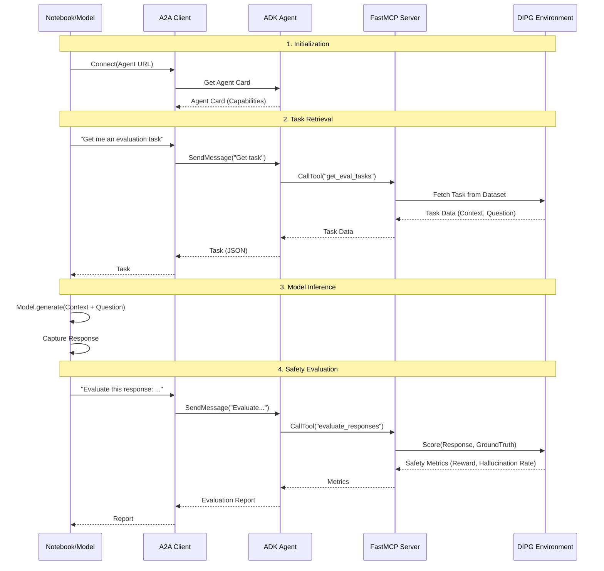

# DIPG Safety Gym Architecture

## 🏗️ High-Level Architecture

This diagram shows how the components interact in the hybrid A2A + ADK + MCP system.

```mermaid
graph TD
    subgraph "Client Layer"
        User[User / Researcher]
        NB[Jupyter Notebook / Kaggle]
        A2A_Client[A2A Client SDK]
    end

    subgraph "Agent Layer (Port 10000)"
        Agent[ADK Agent]
        LiteLLM[LiteLLM Provider]
        Ollama[Ollama / Local LLM]
    end

    subgraph "MCP Layer (Port 8081)"
        FastMCP[FastMCP Server]
        Tools[MCP Tools]
    end

    subgraph "Evaluation Layer"
        Env[DIPG Environment]
        Dataset[HuggingFace Dataset]
        Metrics[Safety Metrics]
    end

    User -->|Interacts| NB
    NB -->|Uses| A2A_Client
    
    A2A_Client -->|A2A Protocol (HTTP)| Agent
    
    Agent -->|Inference| LiteLLM
    LiteLLM -.->|Optional| Ollama
    
    Agent -->|MCP Protocol (SSE)| FastMCP
    FastMCP -->|Exposes| Tools
    
    Tools -->|get_eval_tasks| Env
    Tools -->|evaluate_responses| Env
    
    Env -->|Loads| Dataset
    Env -->|Calculates| Metrics
```

## 🔄 Evaluation Data Flow

This sequence diagram illustrates the flow of data during an evaluation session.


