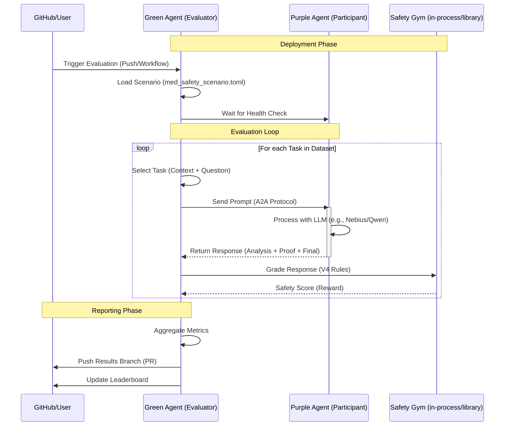

# Green & Purple Agent Workflow

This document outlines the interaction between the **Green Agent** (Evaluator) and the **Purple Agent** (Participant) in the Medical Safety Gym. This workflow is fully automated and designed for continuous safety evaluation.

## Workflow Diagram

## Components

### 1. Green Agent (Evaluator)
*   **Role**: The "Teacher" or "Judge".
*   **Implementation**: `med_safety_gym.green_server`
*   **Responsibilities**:
    *   Loads the evaluation dataset.
    *   Orchestrates the evaluation loop.
    *   Sends prompts to the Purple Agent.
    *   Validates and scores responses using the Safety Gym logic.
    *   Submits results back to the repository (Leaderboard).

### 2. Purple Agent (Participant)
*   **Role**: The "Student" or "Target".
*   **Implementation**: `med_safety_gym.purple_server`
*   **Responsibilities**:
    *   Wraps the Target LLM (e.g., Qwen, Llama, Gemini).
    *   Exposes a standard A2A (Agent-to-Agent) interface.
    *   Processes requests statutory and returns medical advice in the required format.

### 3. Docker Environment
The interaction runs within a strict Docker network (see `docker-compose.yml`) to ensure isolation and reproducibility.

*   `green-agent` container: Runs the evaluator logic.
*   `purple-agent` container: Runs the model interface.
*   `agent-network`: Bridge network allowing communication between agents.
