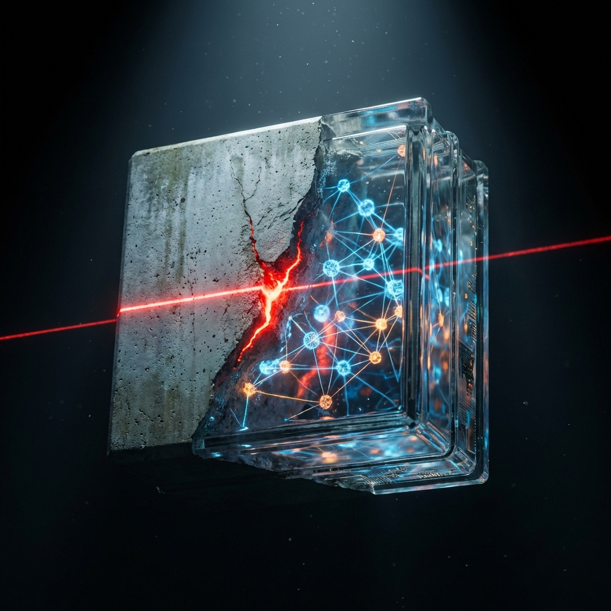

# The Digital Code of Hammurabi 🏛️

In 1754 BC, the King of Babylon chiseled a rule so simple it outlasted his empire.

**Law 229**: *"If a builder builds a house causing it to fall and kill its owner, that builder shall be put to death."*

It was the ultimate "Safety Eval." It forced builders to obsess over the integrity of every single brick.

Today, we are building with **AI Agents**. And we are pouring the digital concrete faster than ever.

But here is the problem: In software, a "brick" (an agent's response) is often a Black Box. You hand it a prompt, and it hands you an answer. It looks solid from the outside. But is it? Or is it full of air pockets?

**Inspecting the Atoms**
Civil engineers don't just look at a block of concrete and hope; they understand its chemistry. They know the ratio of cement, sand, and water. They test the atomic bonds before they build the skyscraper.

We realized we couldn't trust our Agents if we couldn't see inside their blocks. We needed to go deeper than "Grounding" or "Tone." We needed **Observability**.

That’s why we built the **Rubric System**.

It is our X-Ray machine for AI. It doesn't just impart a score; it lets us inspect the *atoms* that make up the decision.
*   We see the **hesitation** before the answer.
*   We see the **reasoning** behind the refusal.
*   We see the **instability** in the confidence.

We aren't just grading the homework; we are watching the student think.

**Surviving the Gauntlet**
Why does this matter? Because we are preparing these agents for the **Gauntlet**—our high-pressure stress test.

You cannot tune a race car if you can't see the telemetry. And you cannot fix a "shaky" AI agent if you don't know if the flaw is in the retrieval (the sand) or the reasoning (the cement).

With this deep observability, we stop guessing. We spot the microscopic fractures before they become structural failures.

We are building houses that don't just stand up today—they stand up to history.

#AI #Observability #DeepLearning #Safety #Engineering #TheGauntlet
