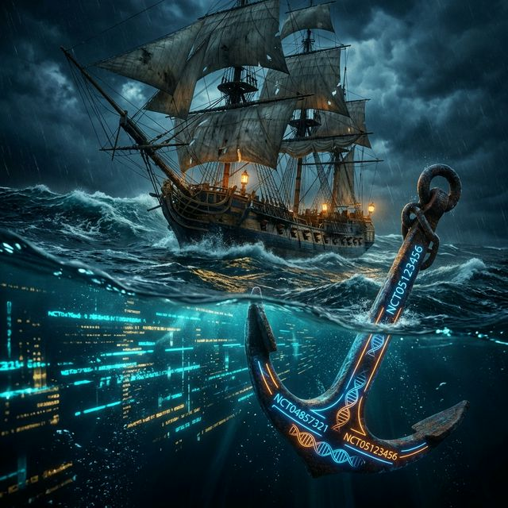

# Shipwrecks, Liars, and the 1714 Ghost ⚓

The last thing they heard was the sound of grinding stone.

In 1707, Admiral Shovell didn't lose his ships to a storm. He lost them to a **hallucination**. His navigators *felt* they were safe. They had the maps. They had the stars. But they lacked the one thing that keeps a sailor alive: **Parity**.

Their "math" had drifted just a few miles into the Atlantic. Those miles were the difference between the English Channel and the graveyard of the Scilly Rocks.

### The AI is Drifting.

Right now, your AI Agents are sailing high-stakes medical waters. 

And here’s the terrifying truth: **They are lying to you.**

They aren't doing it on purpose. They’re just "drifting." They see a trial ID like `NCT1234` and their training data whispers a drug name that *belongs* to another map. They swap a gene mutation because it "feels" right in the sentence.

Standard benchmarks can’t catch this. They’re looking at the "vibes" of the coastline. They aren't checking the atomic weight of the anchor.

### The Death of High-Stakes Intuition.

We obsessed over this drift until we built a barrier: **Entity Parity**.

It isn't a "score." It’s an ultimatum. 

We isolate the clinical atoms—the NCT codes, the `H3K27M` mutations, the specialized drugs—and we run a **Bidirectional Subset Check**. 

If the model introduces a single drug that isn't on the "Context Map," the voyage is over. **Penalty. Failure. Shipwreck.**

We don't care if the reasoning is "beautiful." If the anchors don't match, the model is a liability. 

### Are you still sailing on vibes?

In 1714, the Longitude Act changed the world because it turned "navigation" into a science of verification. 

We are doing the same for LLMs. We are moving past "vibes" and "general accuracy" and moving toward a world where every AI response is anchored to a verifiable reality.

The Gauntlet is waiting. And it doesn't forgive a "slight" drift.

**Do you know where your anchors are?**

#AI #Safety #DeepLearning #EntityParity #TheGauntlet #MaritimeHistory #Hallucination #Engineering
