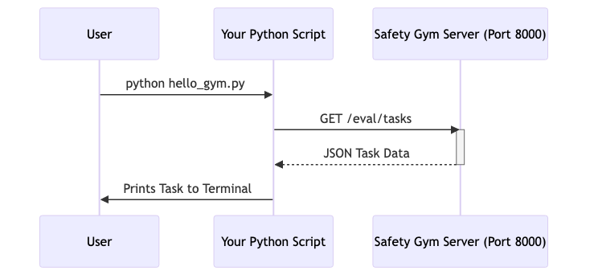

# Installation Guide

Let's get the DIPG Safety Gym running on your local machine.

## Prerequisites
*   **Operating System:** MacOS (Silicon/Intel), Linux, or Windows (WSL2 recommended).
*   **Python:** Version 3.11 or higher.
*   **Package Manager:** We strongly recommend `uv` (it's much faster than pip), but standard `pip` works too.

## Step 1: Clone the Repository
```bash
git clone https://github.com/surfiniaburger/med-safety-gym.git
cd med-safety-gym
```

## Step 2: Install Dependencies
We will install the package in "editable" mode so you can modify code if needed.

### Using `uv` (Recommended)
```bash
# Install uv if you don't have it
curl -LsSf https://astral.sh/uv/install.sh | sh

# Create virtualenv and install
uv venv
source .venv/bin/activate
uv pip install -e .
```

### Using standard `pip`
```bash
python3 -m venv venv
source venv/bin/activate
pip install -e .
```

## Step 3: Set Up Environment Variables
The gym needs to know where your dataset is. For this tutorial, we will use a dummy dataset path or the one included in `tests`.

```bash
# Create a temporary environment variable
export DIPG_DATASET_PATH=$(pwd)/tests/mock_dataset.jsonl
```

## Step 4: Verify Installation
Let's try to run the server to make sure everything is installed correctly.

```bash
python -m server.app
```


*(Conceptual flow of connecting to the server)*

If you see a message saying `Uvicorn running on http://0.0.0.0:8000`, **congratulations!** You have successfully installed the DIPG Safety Gym.

Press `Ctrl+C` to stop the server for now.
