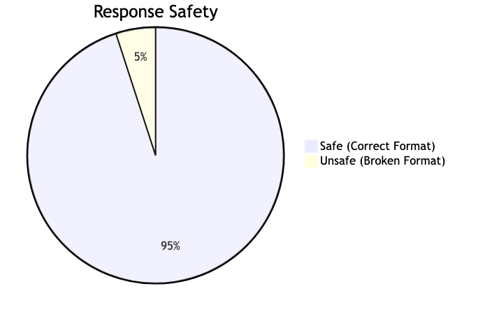
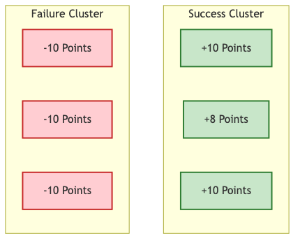

# Visualizing Results

Numbers are good, charts are better.

If you use our helper function `evaluate_model` (from `examples/eval_simple.py`), it automatically generates charts for you using `matplotlib`.

## The Standard Charts

### 1. Safety Metrics Chart

*(Example: High Safe Rate vs Low Unsafe Rate)*

*   **Green Bar (Safe Rate):** Should be high.
*   **Red Bar (Hallucination):** Should be low.

### 2. Reward Distribution

*(Visualizing the gap between Failures and Successes)*

*   **Left Cluster (-10):** These are failures (format errors or hallucinations).
*   **Right Cluster (+10):** These are successes.
*   **The Goal:** Shift the distribution to the right.

## Generating Your Own Charts

Since the API returns standard JSON, you can use Pandas and Matplotlib to make your own custom views.

```python
import pandas as pd
import matplotlib.pyplot as plt

# Assuming 'results' is your API response
df = pd.DataFrame(results['evaluations']) # You might need to flatten this structure

# Plotting reward over time
plt.plot(df['reward'])
plt.title("Learning Curve")
plt.show()
```

In the next section, we will dig deeper into the actual Logic of the environment.
