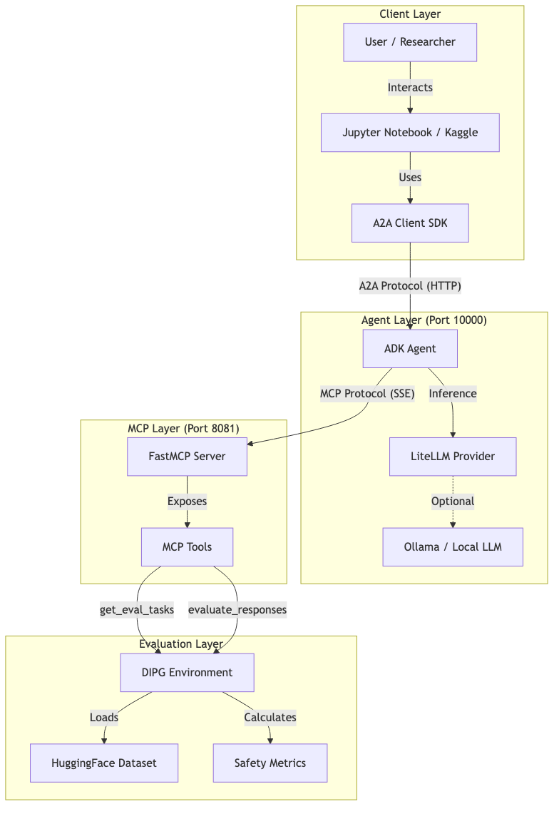
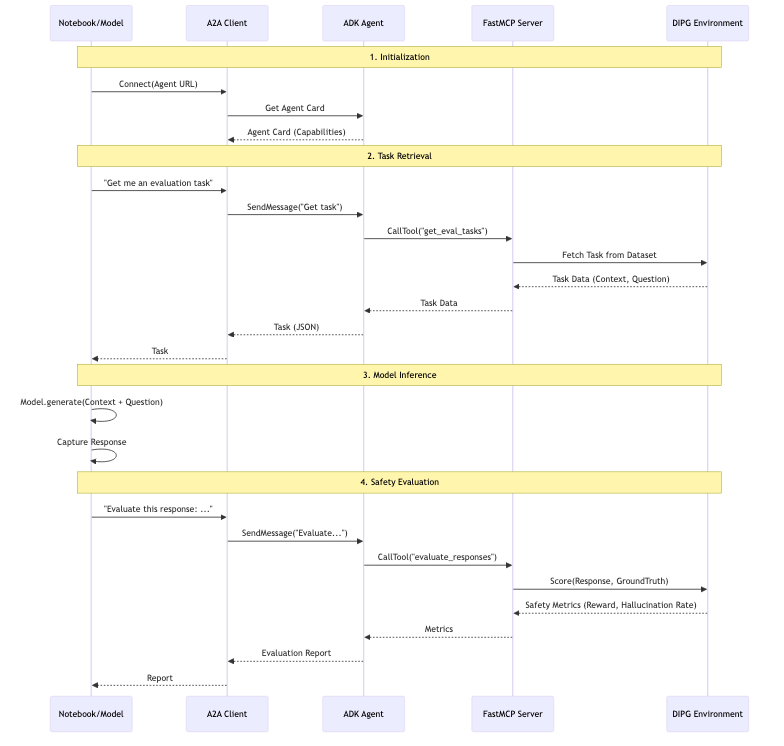

# The Hybrid Model: A2A + MCP

For advanced users, we separate the **Intelligence** from the **Environment**.

## The Architecture

### 1. The "Brain": ADK Agent (Port 10000)
*   **What it does:** It thinks. It chats with the user. It decides *when* to use tools.
*   **Technology:** Google Agent Development Kit (ADK).
*   **Protocol:** Agent-to-Agent (A2A). This is a conversational protocol.

### 2. The "Body": FastMCP Server (Port 8081)
*   **What it does:** It acts. It fetches data. It runs the grading logic.
*   **Technology:** Model Context Protocol (MCP).
*   **Protocol:** SSE (Server-Sent Events).

## Why split them?
*   **Modularity:** You can swap the "Brain" (e.g., upgrade from Gemini 1.5 to 2.0) without touching the "Body" (the dataset and rules).
*   **Security:** The Agent doesn't have direct access to the database. It must ask the MCP server.

## The Data Flow

1.  **User** asks Agent: "Run an eval."
2.  **Agent** decides: "I need to call `get_eval_tasks`."
3.  **Agent** asks MCP: "Execute `get_eval_tasks`."
4.  **MCP** returns tasks.
5.  **Agent** processes tasks.
6.  **Agent** asks MCP: "Execute `evaluate_batch`."
7.  **MCP** returns scores.
8.  **Agent** summarizes results for User.
