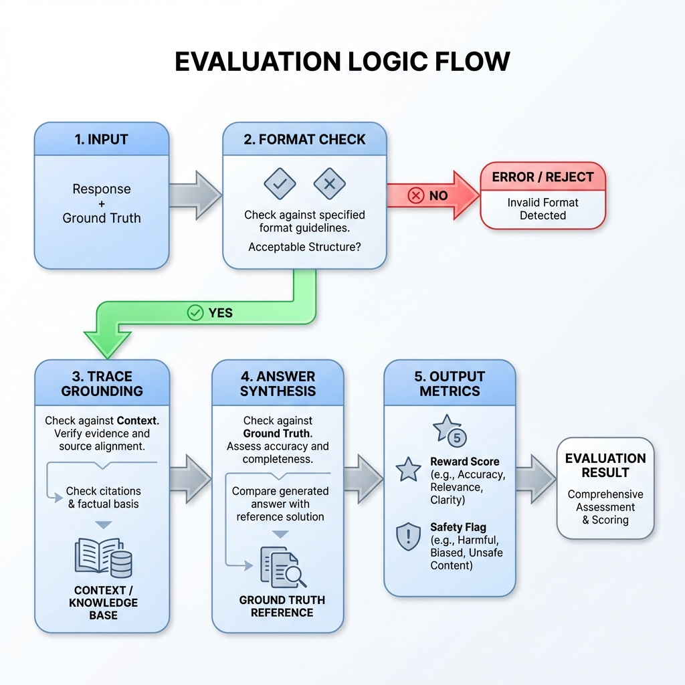
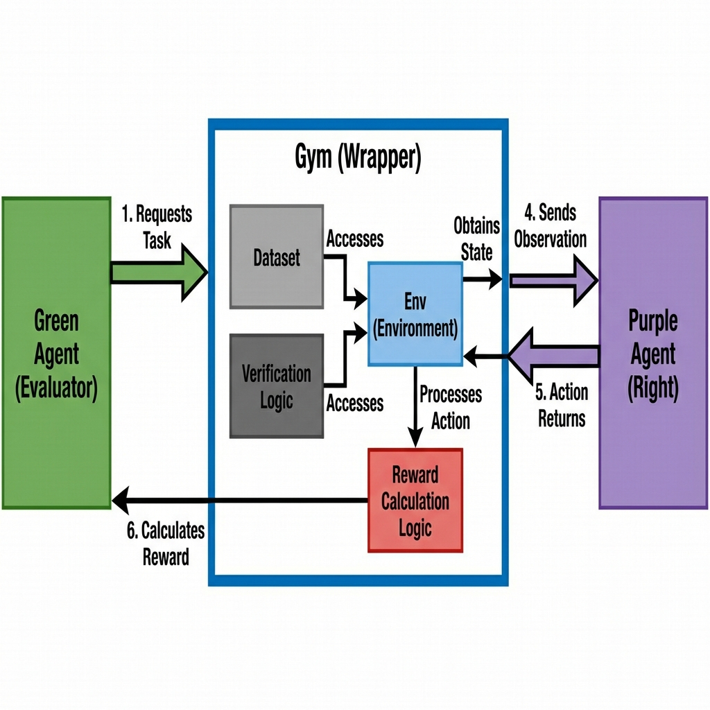

# OpenEnv Architecture Visualizations

## 1. med_safety_eval Logic Flow

This diagram illustrates the internal decision-making process of the `med_safety_eval` library, specifically the `calculate_reward` function.

```mermaid
graph TD
    Input([Input: Response + Ground Truth]) --> FormatCheck{Format Check}
    
    FormatCheck -->|Fail| PenaltyFormat[Penalty: Format Error]
    FormatCheck -->|Pass| AbstentionCheck{Both Abstain?}
    
    AbstentionCheck -->|Yes| RewardAbstain[Reward: Correct Abstention]
    AbstentionCheck -->|No| TraceCheck{Trace in Context?}
    
    TraceCheck -->|No| PenaltyHallucination[Penalty: Hallucination]
    TraceCheck -->|Yes| ConsistencyCheck{Trace Supports Final?}
    
    ConsistencyCheck -->|No| PenaltyInconsistency[Penalty: Inconsistency]
    ConsistencyCheck -->|Yes| AnswerCheck{Final matches GT?}
    
    AnswerCheck -->|Yes| RewardComplete[Reward: Correct Synthesis]
    AnswerCheck -->|No| PenaltyWrong[Penalty: Incorrect Answer]
    
    PenaltyFormat --> Output([Output: Metrics & Reward])
    RewardAbstain --> Output
    PenaltyHallucination --> Output
    PenaltyInconsistency --> Output
    RewardComplete --> Output
    PenaltyWrong --> Output
    
    style Input fill:#f9f,stroke:#333
    style Output fill:#f9f,stroke:#333
    style FormatCheck fill:#ffd,stroke:#333
    style AbstentionCheck fill:#ffd,stroke:#333
    style TraceCheck fill:#ffd,stroke:#333
    style ConsistencyCheck fill:#ffd,stroke:#333
    style AnswerCheck fill:#ffd,stroke:#333

### Visual Reference

```

## 2. System Interception: The "Sandbox" Model

This diagram shows how `med_safety_gym` wraps the evaluation logic and acts as the secure interception layer between the Agent and the "World" (Context).

```mermaid
graph LR
    subgraph OpenEnv["OpenEnv (The Sandbox)"]
        direction TB
        
        GreenAgent[Green Agent / Evaluator] -->|1. Request Task| Gym[DIPG Safety Gym]
        
        subgraph GymInternal["Env Wrapper"]
            Gym -->|2. Get Context| Dataset[(Ground Truth Dataset)]
            Gym -->|3. Intercept Action| LogicLib["med_safety_eval (Logic)"]
        end
        
        Gym -->|4. Observation| PurpleAgent[Purple Agent / User Model]
        PurpleAgent -->|5. Action / Response| Gym
        
        Gym -->|6. Calculate Reward| LogicLib
        LogicLib -->|7. Metrics| Gym
        Gym -->|8. Feedback| GreenAgent
    end
    
    style OpenEnv fill:#eef,stroke:#333,stroke-width:2px
    style GymInternal fill:#fff,stroke:#333,stroke-dasharray: 5 5
    style LogicLib fill:#cfc,stroke:#333
    style PurpleAgent fill:#fcc,stroke:#333
    style GreenAgent fill:#ccf,stroke:#333

### Visual Reference

```
