# Manifest Registration & Permission Tiers — As-Built Design

How SafeClaw handles skill registration, permission escalation, and the relationship between **manifests**, **FastMCP scopes**, and **visibility tags**, as implemented in Phase 39.

---

## 1. The Core Architecture: Governor & Runner

SafeClaw moves safety logic out of the agent's "head" (prompts) and into the architecture.

- **The Governor (The Hub)**: A centralized FastAPI service (`observability_hub.py`) that serves the unique **Ground Truth Manifest**. All security policies originate here.
- **The Runner (The Agent)**: An ephemeral agent (`SafeClawAgent`) that boots with zero permissions and must fetch its policy from the Governor via `/manifest`.

---

## 2. Tiered Permission Model

We use a 4-tier system to classify every tool in the `claw_manifest.json`:

```json
{
  "name": "safe-claw-core",
  "version": "2.2.0",
  "permissions": {
    "net": ["api.github.com", "api.openai.com"],
    "fs": ["./workspace"],
    "tools": {
      "user": ["list_issues", "list_pull_requests"],
      "write": ["create_issue", "voice_mode"],
      "admin": ["delete_issue_comment", "unlock_admin_tools"],
      "critical": ["delete_repo", "purge_all_sessions"]
    }
  }
}
```

### The Hierarchy of Friction:

| Tier | Governance Level | User Experience | Implementation |
|---|---|---|---|
| **User** | Implicit | Allowed immediately. | No auth required. |
| **Write** | Verified | Allowed immediately. | `auth="write"` checked. |
| **Admin** | Escalated | Requires **JIT Approval**. | `tags=["admin"]`. Hidden by default. |
| **Critical** | Hardened | Requires **Biometrics + Vision Audit**. | `tags=["admin", "critical"]`. |

---

## 3. Just-In-Time (JIT) Escalation Flow

We do not believe in "Admin Mode" that stays on forever. We implement **Just-In-Time (JIT)** escalation.

```mermaid
sequenceDiagram
    participant User as User (Telegram)
    participant Runner as Runner (SafeClawAgent)
    participant Hub as Hub (Governor)
    participant Auth as AuthGuard (TouchID)

    User->>Runner: "delete repo: med-safety"
    Runner->>Hub: GET /manifest/tier/delete_repo
    Hub-->>Runner: tier: "critical"
    
    Runner->>User: 🚨 "Critical Action detected. Please confirm."
    User->>Runner: Click [Confirm]
    
    Runner->>Auth: Trigger require_local_auth()
    Auth-->>User: TouchID Prompt
    User->>Auth: Successful Scan
    
    Runner->>Runner: Temporary TTL lease (60s)
    Runner->>GitHub: Execute delete_repo
```



### Key Security Invariants:
1. **TTL-Based Leasing**: Admin tools are only "unlocked" in the `SessionMemory` for a short window (e.g., 5-10 minutes).
2. **Biometric Gate**: `admin` and `critical` tiers trigger `auth_guard.py` which uses the host's native biometric (macOS TouchID) to verify the physical presence of the user.
3. **Out-of-Band Policy**: The agent cannot modify its own manifest. The manifest is signed and served by the Hub.

---

## 4. Manifest-to-FastMCP Mapping

The `SkillManifest` class auto-generates the `ScopeConfig` needed to bake safety into the tool registry:

```python
def generate_scope_config(self) -> Dict[str, ScopeConfig]:
    config = {}
    for tool_name in self.permissions.tools.user:
        config[tool_name] = ScopeConfig(auth="", tags=[])
    for tool_name in self.permissions.tools.write:
        config[tool_name] = ScopeConfig(auth="write", tags=[])
    for tool_name in self.permissions.tools.admin:
        config[tool_name] = ScopeConfig(auth="admin", tags=["admin"])
    for tool_name in self.permissions.tools.critical:
        # Critical tools are admin tools WITH extra vision auditing
        config[tool_name] = ScopeConfig(auth="admin", tags=["admin", "critical"])
    return config
```

---

## 5. Deployment Reality (Phase 39)

| Feature | Design Intent | Current Implementation (`med_safety_gym`) |
|---|---|---|
| **Storage** | SQL Database | `claw_manifest.json` on disk (Hub serves it) |
| **Escalation** | Manual Button | JIT Biometric (`auth_guard.py`) + Inline Buttons |
| **Visibility** | Hidden Tools | `ManifestInterceptor` filters available tools in real-time |
| **Auditing** | CSV/Log | `_audit()` method logs to Python `logging` + SessionMemory |

---

## 6. Next Steps: Roadmap to Phase 40

1. **Vision Audit Integration**: Hook the `VisionAuditService` into the `critical` tier path to "see" the terminal state before high-stakes cleanup.
2. **Multi-Tenant Hub**: Allow the Hub to serve different manifests to different Runners based on an `Agent-ID` token.
3. **Registry Signature**: Sign the Hub's JSON response with a private key; the Runner verifies it with a public key to prevent "Ghost Gateway" Man-in-the-Middle attacks.
