# SafeClaw: Agentic Evaluation & Multi-Turn Context Flow

This document outlines the architectural integration of SafeClaw's **Multi-Turn Context Loop** (Phase 44) and its **Agentic Benchmarking Framework** (Phase 45).

## 1. Integrated Architecture Overview

SafeClaw uses an **Agent-to-Agent (A2A)** protocol to decouple the subject of evaluation (SafeClaw) from the evaluation orchestrator (Benchmark Server).

```mermaid
graph TD
    subgraph "External/Testing Environment"
        User[Human/Tester] --> |"Triggers Scenario"| BS["🚀 Benchmark Server<br/>(A2A Orchestrator)"]
    end

    subgraph "SafeClaw Agency (Target)"
        CS["🤖 SafeClaw Server<br/>(gemma3:1b/Local LLM)"]
        SM["🧠 SessionMemory"]
        IC["🔍 Intent Classifier"]
        GR["⚖️ Governor/Interceptor"]
    end

    BS --> |"Prober Message (A2A)"| CS
    CS --> |"Update History"| SM
    CS --> |"Inference"| IC
    CS --> |"Safety Check"| GR
    CS --> |"Subject Response (A2A)"| BS

    BS -.-> |"Grading (Rubric)"| HBG["📝 HealthBench Grader"]
```

## 2. Multi-Turn Context Loop (Phase 44)

To solve the **"Intent Mismatch"** problem identified in research (bench_1, bench_2), SafeClaw implements a decoupled session memory and intent classification flow.

### Flow Logic
1.  **Incoming Message**: The `ClawServer` receives a message (via Telegram or A2A).
2.  **Context Retrieval**: `SessionMemory` provides the last $N$ turns and extracted medical entities.
3.  **Intent Classification**: The `IntentClassifier` tags the message (e.g., `Follow-up`, `Refinement`, `Recollection`).
4.  **Mediator Prompting**: The agent uses these tags to determine if the user is correcting an assumption or expanding on a query.
5.  **Execution**: The LLM generates a response filtered by the **Entity Parity Interceptor**.

## 3. Agentic Benchmarking Framework (Phase 45)

Rather than static prompt injection, SafeClaw implements an **Agentic Prober** system that simulates live conversations.

### Benchmark Taxonomy (Logic-Based)
I have implemented the **logic** of three major benchmarks to allow for dynamic, multi-turn "stress tests":

*   **MT-Eval (Recollection)**: A state-machine prober that deliberately tests if the model remembers what was said 3 turns ago.
*   **MediQ (Info-Seeking)**: A "Socratic Patient" prober that provides vague information to see if the agent asks clarifying questions before diagnosing.
*   **AMIE (Diagnostic Loops)**: A prober with "Hidden Symptoms" (e.g., Stage 4 DIPG) that are only revealed if the agent asks the correct history questions.

### The A2A Validator Pattern
The evaluation framework is designed to move beyond unit tests into a **Validator Role**:
1.  **Isolation**: The Benchmark Server runs in a separate process/container, simulating a real-world "Fact Checker".
2.  **Rubric Grading**: The `HealthBenchGrader` uses heuristic and (future) LLM-based rubrics to score transcripts based on **Abstention Accuracy** and **Safety Invariants**.

## 4. Architectural Invariants
*   **Minimal Framework Surface**: `google-adk` is isolated behind `EvaluationOrchestrator`.
*   **Entity Parity Enforcement**: No medical response is permitted if new entities are introduced without a corresponding "I do not know" or clarifying question.
*   **Asynchronous TDD**: All benchmarking logic is verified via async unit tests (`test_eval_agent.py`) ensure no regression in multi-turn logic.

---
> [!TIP]
> This framework allows us to track **Model Performance** (e.g., Gemma 3:1b vs. DeepSeek) in a clinical-safety context without manual auditing of every transcript.
