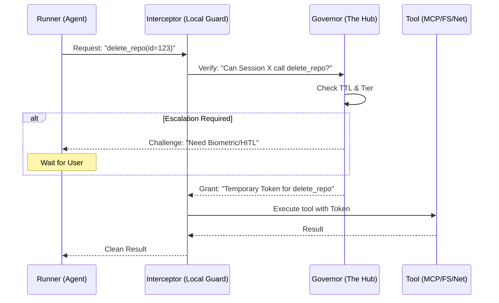

# Architectural Sovereignty: The Governor vs. The Runner

This document defines the separation of powers in the SafeClaw ecosystem. To move from a "trusted script" to a "governed platform," we must enforce a strict boundary between the entity that makes security decisions and the entity that executes agent logic.

---

## 1. The Core Split

SafeClaw is bifurcated into two distinct sovereign domains:

### A. The Governor (The Brain/PDP)
- **Role**: Policy Decision Point (PDP).
- **Responsibilities**:
    - **Manifest Authority**: Holds the single source of truth for tool tiers (`user`, `write`, `admin`).
    - **Identity Verification**: Manage user sessions, biometric auth tokens (`TouchID`), and Telegram pairing.
    - **Secret Management (Keyring)**: Securely stores delegation tokens and Hub public keys via OS-level native keychain mechanisms (e.g., macOS Keychain) using `med_safety_gym.identity.secret_store.SecretStore`, ensuring credentials are never exposed in plaintext configurations or environment variables used by the Runner.
    - **Audit Log Integrity**: Immutable record of all requested vs. executed actions.
    - **Invariant Enforcement**: Verifies that an action matches the required rubric *before* execution.
- **Trust Level**: **Sovereign**. This is the highest trust zone.

### B. The Runner (The Agent/PEP)
- **Role**: Policy Enforcement Point (PEP) / Execution Environment.
- **Responsibilities**:
    - **Tool Invocation**: Generating parameters for tool calls.
    - **External Integration**: Fetching URLs, reading files, interacting with MCP servers.
    - **RAG Latency**: Managing the context window and token limits.
- **Trust Level**: **Untrusted/Semi-Trusted**. The Runner is assumed to be susceptible to prompt injection.

---

## 2. The Communication Protocol: "Intercept-by-Default"

The Runner **cannot** execute any tool directly. It must pass through a `ManifestInterceptor`.

---

## 3. Why This Rebuilds OpenClaw Safely

OpenClaw currently collapses these domains. The logic is:
> *"I trust the user who paired with the gateway, therefore I trust the agent running in that session."*

**SafeClaw Invariant**:
> *"We trust the User, we NEVER trust the Agent. The Agent is a tool-using entity that might be hijacked by the very data it reads (Indirect Prompt Injection)."*

### Key Invariants to Implement:
1.  **Isolation**: A Runner should never see the full manifest of `Admin` tools unless it specifically requests escalation for a single action.
2.  **Stateless Execution**: Runners are ephemeral. If a Runner is compromised, we kill the container. The Governor (Hub) survives and revokes the session.
3.  **Visual Parity**: The Governor uses Gemini Vision to audit what the Runner *claims* it is doing vs. what it is *actually* doing.

---

## 4. Sovereignty Map

| Capability | Governor | Runner |
| :--- | :---: | :---: |
| Store API Keys | ✅ | ❌ |
| Run Arbitrary Code | ❌ | ✅ |
| Approve Deletion | ✅ | ❌ |
| Normalize Synonyms | ❌ | ✅ |
| Revoke Access | ✅ | ❌ |
| Parse LLM Output | ❌ | ✅ |

---

> [!IMPORTANT]
> This split allows us to expose the SafeClaw Hub to the public internet while keeping the high-risk "Runners" in a locked-down, outbound-only VPC.
