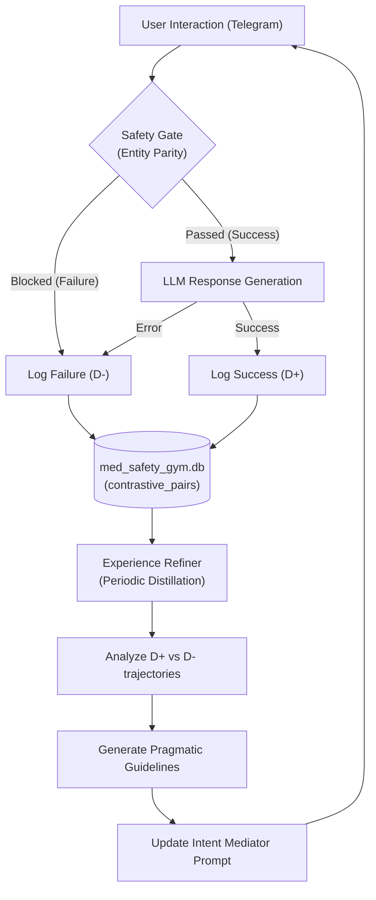

# Contrastive Learning & Experience Refinement

This document explains the **Experience Refinement Loop** (Phase B) of the SafeClaw architecture. This loop allows the system to learn from its own interaction successes and failures without retraining the core model.

## The Loop Architecture

## Key Components

### 1. Contrastive Pair Collection (Live)
Every turn in the conversation is captured within its context.
- **Success (D+)**: The agent successfully navigated the intent and provided a safe response.
- **Failure (D-)**: The agent either wrongly blocked a valid request (False Positive) or failed to handle a multi-turn change in topic.

### 2. Experience Refiner (Offline/Periodic)
A more powerful model (e.g., Gemini 1.5 Pro) reviews the captured trajectories to find linguistic patterns.
- It identifies words that cause false positive blocks (e.g., "switching", "currently").
- It identifies intent misclassifications (e.g., missed corrections).

### 3. Pragmatic Guidelines
The output is a set of natural language "rules" that are injected into the **Intent Mediator's** system prompt.
- *Example*: "When a user says they are 'switching' to a new drug, do not treat it as an unverified external entity; look for it in the previous context."
