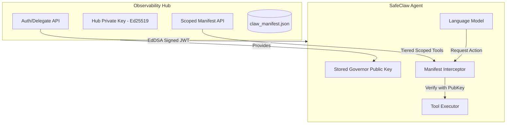
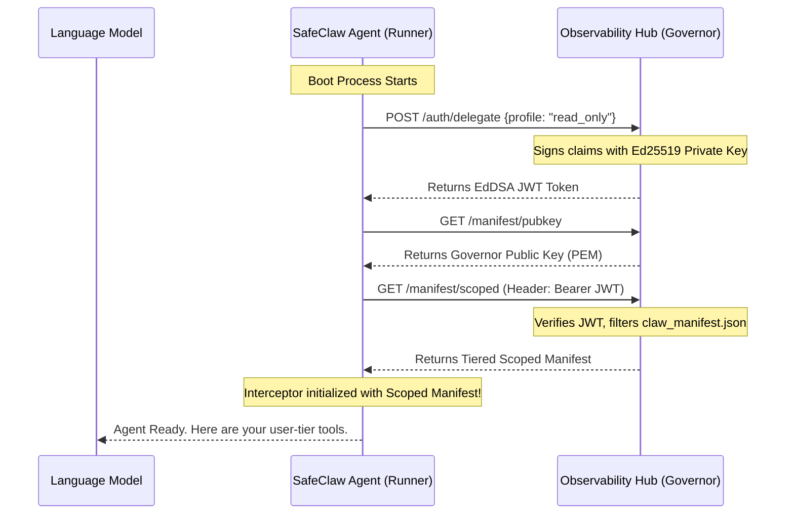

# SafeClaw Delegation Flow

Welcome to the **Sovereign Hub & Cryptographic Identity** system in SafeClaw. This document explains how an Agent (Runner) secures its session using Asymmetric Cryptography and Scoped Manifests.

---

## 🏗️ 1. Sovereign Architecture

In SafeClaw, we separate the **Governor** (Authority) from the **Runner** (Execution). This follows a Zero-Trust model where the Runner does not possess any long-lived shared secrets.

### Core Components
1.  **Observability Hub (Governor):** The sovereign authority. It signs delegation tokens using a persistent **Ed25519 Private Key**.
2.  **SafeClaw Agent (Runner):** Operates on the local machine. It fetches the Governor's **Public Key** at boot and uses it for all subsequent local verifications.
3.  **Manifest Interceptor:** The internal security guard. It ensures the LLM can only see and call tools explicitly allowed in the current session's cryptographic scope.

---

## 🚀 2. The Cryptographic Boot Sequence

When a SafeClaw Agent starts, it performs a secure handshake to lock down the environment.

---

## 🛡️ 3. Tiered Security Architecture

Instead of a flat list of tools, the Hub sends a **Tiered Manifest**. This is critical for maintaining SafeClaw's internal security logic:

| Tier | Behavior | Example Tools |
| :--- | :--- | :--- |
| **User** | Allowed immediately. | `list_issues`, `read_file` |
| **Admin** | Requires JIT Escalation (Context check). | `delete_issue_comment` |
| **Critical** | Requires **Biometric Auth** + **Telegram Approval**. | `delete_repository`, `unlock_admin_tools` |

**Why not flatten the list?**
If the Hub only sent a flat list, the Agent wouldn't know which tools are "Critical". By preserving the original tiers in the scoped manifest, we ensure that local safety guards (like `interceptor_logic.py`) still trigger the correct level of friction (JIT vs. HITL).

---

## 🛑 4. Verification and Gating

Before any tool touches your system, the `Manifest Interceptor` (Runner-side) performs the following **Zero-Trust** checks in `_verify_and_gate_tool_call`:

1.  **Asymmetric Signature Check**: The JWT is verified using the Governor's Public Key. This prevents "Key Confusion" attacks and ensures only the official Hub can authorize actions.
2.  **Tier Existence**: The requested tool must exist in one of the tiers (`user`, `admin`, `critical`) provided by the scoped manifest.
3.  **Profile Consistency**: The token's claims (e.g., `profile: "read_only"`) are checked against the requested operation.

### Defensive Engineering
- **Missing Key Fail-Safe**: If the Agent fails to retrieve the Governor's public key, it enters a `failed` state and blocks all tool execution.
- **Algorithm Lockdown**: The system explicitly detects PEM headers and locks the algorithm to `EdDSA`, preventing attackers from using the Public Key as a symmetric (HS256) secret.

---

## 🔑 Key Management Summary

| Feature | Legacy (Pre-Phase 40) | Modern (Sovereign Identity) |
| :--- | :--- | :--- |
| **Algorithm** | HS256 (Symmetric) | **EdDSA (Asymmetric Ed25519)** |
| **Secret Storage** | Shared `JWT_SECRET` | **Governor-only Private Key** |
| **Verification** | Shared Secret | **Hub-provided Public Key** |
| **Architecture** | Coupled | **Separated (Sovereign)** |
| **Manifest Scoping** | Flattened | **Tier-Preserving** |
