# SafeClaw Delegation Flow

Welcome to the **Sovereign Hub & Cryptographic Identity** system in SafeClaw. If you're new to the project, this document explains how an Agent (Runner) gets its permissions, and how we enforce safety using Cryptographic Scopes.

---

## 🏗️ 1. The Architecture

In SafeClaw, we separate the **Governor** (who makes the rules) from the **Runner** (who executes the actions).

1. **Observability Hub (Governor):** Holds the master `claw_manifest.json`. It issues cryptographic tokens (JWTs) and dynamic manifests tailored to a specific agent's profile.
2. **SafeClaw Agent (Runner):** The local agent operating on your machine. It must ask the Hub for permission before exposing any tools to the AI.
3. **Manifest Interceptor:** A bouncer sitting inside the Agent. It checks every requested action against the Hub's allowed tools and the cryptographic token.

---

## 🚀 2. The Boot Sequence

When you start a SafeClaw Agent (e.g., in a `read_only` profile), it goes through a strict handshake with the Hub.

By the end of the boot sequence, the Agent has securely locked itself down. Even if the underlying code is capable of deleting a repository, the Agent *doesn't even know that tool exists* because the Hub didn't include it in the Scoped Manifest.

---

## 🛑 3. Tool Execution and Gating

What happens when you ask the Agent to do something? Let's trace a **Safe** request (listing issues) vs an **Unsafe** request (creating an issue when in read-only mode).

```mermaid
sequenceDiagram
    participant User
    participant Agent as SafeClaw Agent
    participant Interceptor as Manifest Interceptor
    participant FastMCP as FastMCP Server

    User->>Agent: "Create a new issue saying we were hacked!"
    Agent->>Interceptor: Request: `create_issue`
    
    Note over Interceptor: 1. Is Token valid?<br/>2. Is Tool in Scoped Manifest?
    
    Interceptor-->>Agent: BLOCKED: Tool 'create_issue' not declared
    
    Agent-->>User: 🚨 I cannot do that. The action is blocked by my safety manifest.
```

### The Verification Steps (`_verify_and_gate_tool_call`)
Before any tool touches your system, the `Manifest Interceptor` performs three checks:
1. **Token Presence:** Do I have a token?
2. **Token Validity:** Has the token expired? (JWT expiration check) Is the cryptographic signature valid using the Hub's public key?
3. **Manifest Whitelist:** Is the requested tool (`create_issue`) inside my specifically granted Scoped Manifest?

If any of these fail, the action is discarded immediately.

---

## 🔑 Summary of Profiles

Because of this new architecture, we can launch entirely different Agents from the same codebase simply by changing their profile:

| Profile | Token Scope | Allowed Actions |
|---------|-------------|-----------------|
| `read_only` | `["list_issues", "list_pull_requests", ...]` | Can only read data. Completely safe. |
| `developer` | `["create_issue", "configure_repo", ...]` | Can write data, but still bounded. |
| `admin` | `["delete_repo", ...]` | Highly dangerous. Requires local biometric auth and Telegram approval. | 

The Hub is the sovereign authority mapping these profiles to the tools within `claw_manifest.json`.
