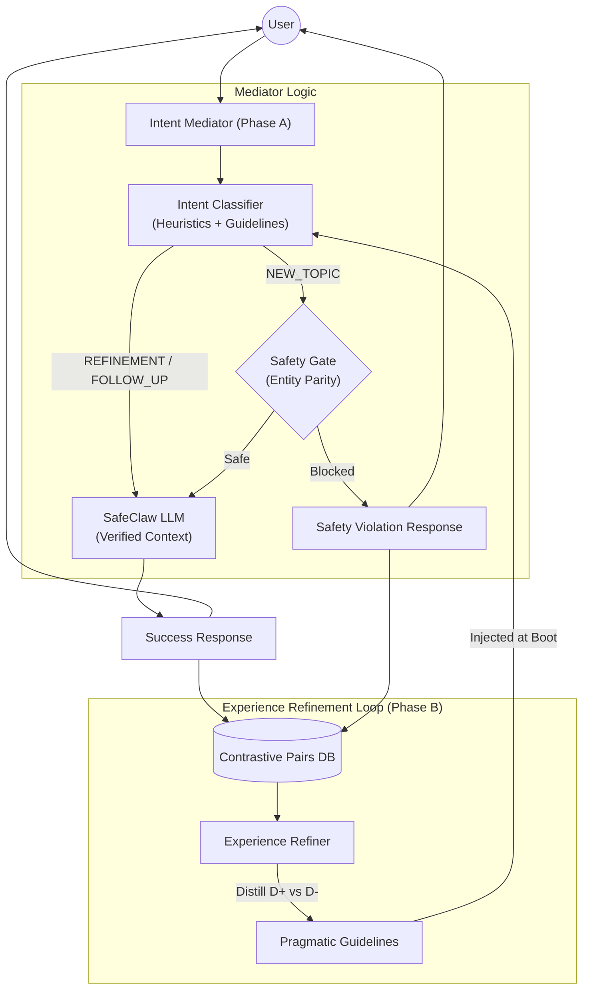

# SafeClaw Holistic Mediator & Learning Flow

This document maps the current state of the SafeClaw interaction loop, integrating the **Phase A (Intent Mediator)** and **Phase B (Experience Refiner)** components.

## Holistic Architecture

## The Sovereignty Mechanism

1.  **Sovereign Decision**: The Mediator decides if a message is a continuation of the safe context (`FOLLOW_UP`) or a pivot to a new clinical action (`NEW_TOPIC`).
2.  **Autonomous Learning**: The Refiner analyzes the traces of these decisions (D+/D-) to synthesize "Pragmatic Guidelines".
3.  **Adaptive Security**: The system prompt and safety gate sensitivity evolve based on these guidelines, reducing friction for safe multi-turn interactions while maintaining the hard medical "sovereignty" boundary.

## Technical Components

| Component | Responsibility | Implementation |
| :--- | :--- | :--- |
| **Intent Mediator** | Classifies intent to scope safety checks. | [intent_classifier.py](file:///Users/surfiniaburger/Desktop/med-safety-gym-v2/med_safety_gym/intent_classifier.py) |
| **Experience Refiner** | Distills pragmatic rules from logs. | [experience_refiner.py](file:///Users/surfiniaburger/Desktop/med-safety-gym-v2/med_safety_gym/experience_refiner.py) |
| **Safety Gate** | Enforces strict Entity Parity. | [mcp_server.py](file:///Users/surfiniaburger/Desktop/med-safety-gym-v2/med_safety_gym/mcp_server.py) |
| **Contrastive DB** | Logs trajectories (D+/D-). | [database.py](file:///Users/surfiniaburger/Desktop/med-safety-gym-v2/med_safety_gym/database.py) |
