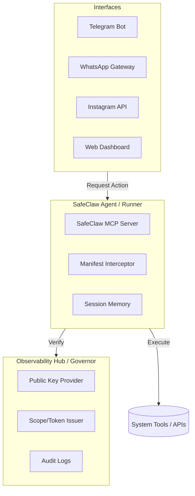

# SafeClaw: Agent-as-Infrastructure Vision

> "The goal of SafeClaw is to build the **Sovereign Security Infrastructure** for autonomous agents—bringing the 'Your machine, your rules' philosophy into a safe, deterministic reality."

---

## 🏗️ 1. The Sovereign Architecture

Inspired by the rapid ascent of projects like **OpenClaw**, SafeClaw aims to provide that same agentic power (managing mail, shell, and messages) but through a **Zero-Trust Governor** model. We separate the "Intelligence" and "Permission" layers from the "Interface" and "Execution" layers.

### 1. The Infrastructure Model
SafeClaw acts as a **middleware** (a "Runner") that can be plugged into any frontend or backend.

---

## 🌍 2. Local-First Philosophy

We believe that high-stakes AI must reside **where your data lives**.

-   **Privacy by Default**: The Agent runs locally on the user's machine (or a private VPC).
-   **No Shared Secrets**: Using EdDSA asymmetric signing, the Runner never needs to "trust" a shared password. It only trusts the Hub's public key.
-   **Config-as-State**: Current states (profiles, manifests) are stored in decentralized JSON/SQLite files, ensuring that even if the internet drops, basic safety invariants remain in-process.

---

## 🛠️ 3. Interface Portability

While we currently prioritize **Telegram** as the primary interface for Manager Approvals (HITL), the architecture is intentionally **agnostic**.

-   **The WhatsApp Goal**: A user could launch a SafeClaw instance and connect it to a WhatsApp-based "Commander" interface.
-   **Infrastructure-as-a-Service**: Third-party apps shouldn't have to build their own security layers. They should "Hire a SafeClaw Runner" to execute tasks on their behalf, secured by a Hub.

---

## 🛰️ 4. The Path to Sovereign Identity

Phase 40 (Sovereign Hub) and Phase 41 (Keyring Integration) are the foundation of this vision. By moving to **Keyring-based storage**, we ensure that even the Agent's credentials are encrypted at rest by the Operating System (macOS Keychain, etc.).

SafeClaw isn't just an app; it's the **Operating System for Safe Agency**.
