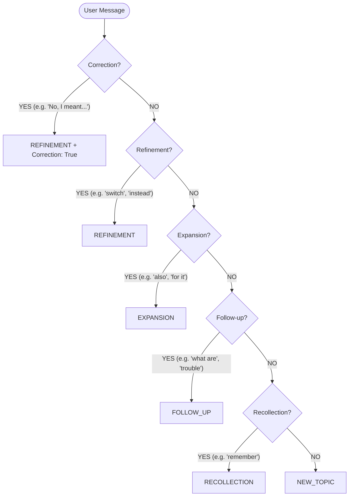

# SafeClaw Intent Identification Matrix

This document defines how SafeClaw judiciously categorizes user intent to balance safety and conversational fluidity.

## Classification Hierarchy

The Intent Mediator uses a hierarchical keyword-matching system (Pragmatic heuristics) to categorize turns:

## Intent to Safety Policy Mapping

| Category | Typical Phrase | Safety Policy |
| :--- | :--- | :--- |
| **REFINEMENT** | "Actually, switch to ONC201." | **Bypass Gate**. Pivot within verified context. |
| **EXPANSION** | "What is the dosing for it?" | **Bypass Gate**. Deepen knowledge of current entity. |
| **FOLLOW_UP** | "What are the side effects?" | **Bypass Gate**. Conversational inquiry. |
| **RECOLLECTION** | "What did we say earlier?" | **Bypass Gate**. Session memory recall. |
| **NEW_TOPIC** | "Treat DIPG with AlphaDrugX." | **GATE ACTIVE**. Absolute Entity Parity check. |

## Judiciousness in Action
- **Pragmatic Bypass**: If the system identifies a message as a continuation (Refinement/Expansion/Follow-up), it trusts that the LLM's strict system prompt (which is bound only to the verified context) will prevent non-hallucinated errors.
- **Sovereign Lock**: If the system identifies a `NEW_TOPIC`, it assumes the user is proposing a new clinical path and enforces the strictest "Sovereign" parity check.
