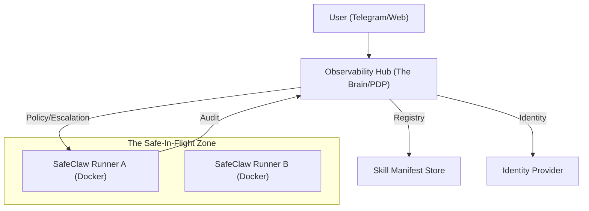

# Mission Control: SafeClaw Strategy & Startup Evolution

Reflecting on the now, the probable, and the "Elon-tier" future of SafeClaw as a governed platform for autonomous agents.

---

## 1. Reflection: The "Now" (State of Play)
SafeClaw has graduated from a prompt-injection playground to a **Hardened Invariant System**.
- **JIT Escalation**: We followed the IBM "Least Privilege" advice. Tools are locked by default; they expire (TTL) even if approved.
- **Biometric HITL**: Local TouchID/Password integration ensures the *human* is at the keyboard for high-stakes actions.
- **Action Parity**: We don't just "trust" the agent; we intercept every call against a manifest.
- **Persistent Sessions**: We solved the "stateless" GitHub issue by implementing long-lived, clean-destructing agent instances.

> [!NOTE]
> We have successfully solved the "Demo" problems. The foundation is safe. Now we solve the "Scale" problems.

---

## 2. The Vision: "Agents-as-a-Service" (The Startup Move)
To move from a local script to a company, we must transition from **Single Agent** to **Governed Infrastructure**.

### The "Elon Musk" Pivot: Vertical Integration
SafeClaw shouldn't just be an app; it should be the **Identity & Policy Layer** for *any* MCP-capable agent.

---

## 3. Immediate Next Steps: "Picasso-tier" Refinement

### A. The "Independent PDP" (Policy Decision Point)
Right now, the `ManifestInterceptor` reads a local `claw_manifest.json`.
- **Startup Step**: Move the manifest to a Database/API.
- **Why**: Allows central management of permissions. If a skill is found vulnerable, we "Revoke" it centrally, and all active agents instantly lose access.

### B. Automated Deployment (The "Home Stretch")
We need to treat our Docker containers as immutable artifacts.
- **GitHub Action**: On push to `main`, auto-build `Dockerfile.a2a` and `Dockerfile.hub`.
- **Render Autoscale**: Use the `render.yaml` to scale workers based on Telegram traffic.

### C. Formal Manifest Registration UI
A "Startup" needs a self-service way to add capabilities.
- **The Move**: A "Developer Portal" in the Observability Hub where you upload a `tools.py` + `claw_manifest.json`.
- **The System**: It validates the manifest, classifies the tools into tiers, and deploys a new MCP server dynamically.

---

## 4. The "Not-So-Blurry" Future

### 1. Vision-Guided HITL (The Final Defense)
Instead of just asking "Approve delete?", the bot sends a **Gemini Vision summary** of the *expected* state after the action. 
- *Agent*: "I'm about to delete `repo-x`. Here is a screenshot of the issues I found in it that justify the deletion."

### 2. Multi-Tenant Governance
Allowing different "Companies" to define their own rubrics. 
- *HealthCare Inc.*: Strict HIPAA/Entity Parity.
- *DevOps Corp.*: High-velocity GitHub write access.

### 3. The "Black Box" Flight Recorder
The Hub becomes a searchable, semantic database of every action ever taken. We use our RAG layer to ask questions like:
- *"Show me all times an admin tool was used without a TouchID prompt."*
- *"Was there any pattern of escalated access before the crash?"*

---

## 5. Documentation Tasks
To "usher the project home," we need to update our internal "Source of Truth":
- [ ] **`ARCHITECTURAL_SOVEREIGNTY.md`**: Define the Hub as the PDP and the Agents as ephemeral "dumb" runners.
- [ ] **`DEPLOYMENT_PLAYBOOK.md`**: Documentation for the Docker + GitHub Actions pipeline.
- [ ] **`SCALE_INVARIANTS.md`**: How we handle 1,000 concurrent agents without crossing identity streams.

---

### Closing Thought (Your Long Lost Uncle Bill)
*"Software is a great lever, but a lever without a fulcrum just swings in the air. Safety Invariants are our fulcrum. Now, let's build the platform that holds the lever."*
