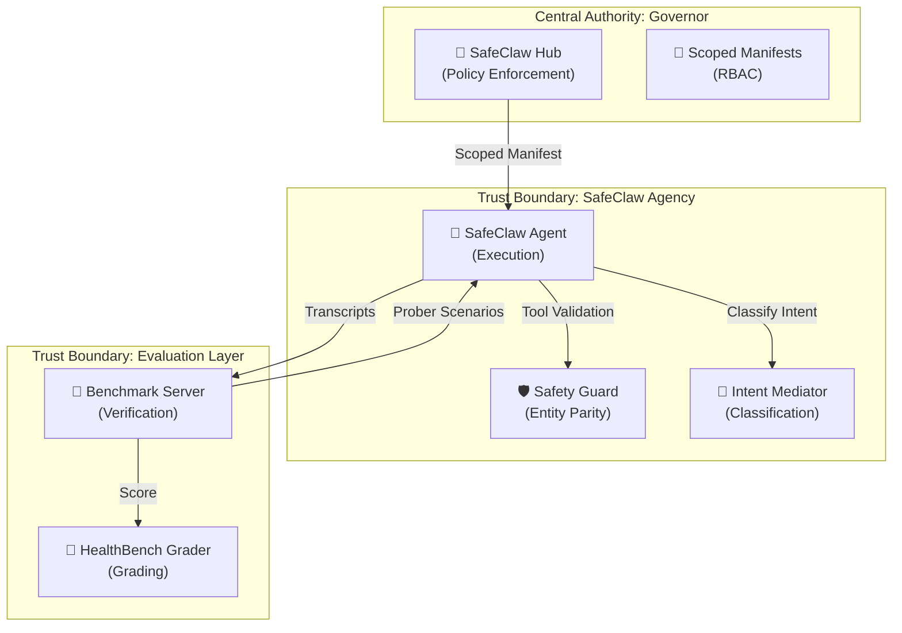
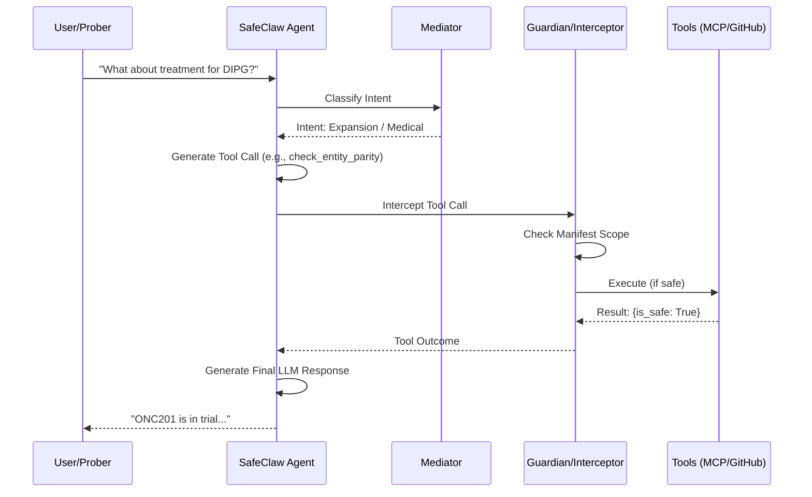
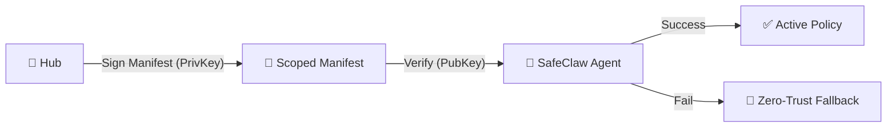

# SafeClaw: Holistic Sovereignty & Safety Blueprint

This document provides a unified, consolidated view of the SafeClaw architecture, integrating the **Intent Mediator**, **Safety Guard (Guardian)**, **Sovereign Governor (Hub)**, and **Agentic Evaluation** systems.

## 1. High-Level Architecture: The Sovereignty Loop

SafeClaw operates as a sovereign agent where policy and identity are enforced by a central Governor, and execution is hardened by an internal safety layer.

---

## 2. The Message Lifecycle: Intent-First Guarding

Every incoming message undergoes a multi-layer verification process before any tool execution or LLM response is generated.

### Execution Flow:
1.  **Classification**: The `IntentClassifier` categorizes the input (e.g., `Follow-up`, `Correction`).
2.  **Mediator Injection**: The intent is used to enrich the LLM's context, mitigating "Intent Mismatch" (Lost in Conversation).
3.  **Scoped Interception**: If the LLM requests a tool call, the `ManifestInterceptor` ensures the tool is within the Governor-approved scope.
4.  **Clinical Safety Gate**: For medical tools, the **Guardian** verifies **Entity Parity** (ensuring no unauthorized medical entities are introduced).

---

---

## 3. Sovereign Policy & Profile Enforcement

The Governor (Hub) dictates the capabilities of the Agent based on a **Profile-to-Tool** mapping. This ensures that a "Read-Only" agent cannot perform destructive "Admin" actions, even if the LLM is compromised.

### Asymmetric Verification Invariant
SafeClaw implements an **Asymmetric Trust Model** to prevent manifest tampering:
1.  **Hub (Governor)**: Generates an Ed25519 key pair. It signs every scoped manifest using its **Private Key**.
2.  **Agent (Subject)**: Fetches the **Public Key** and uses it to verify the digital signature of the manifest.
3.  **Result**: An unsigned or tampered manifest is immediately rejected by the Agent, which falls back to a "Zero-Trust" restricted policy.

### Profile Scopes (RBAC)
| Profile | Allowed Scopes | Key Capabilities |
| :--- | :--- | :--- |
| **Read-Only** | Information Retrieval | `list_issues`, `check_entity_parity` |
| **Developer** | Repository Management | `configure_repo`, `create_issue` |
| **Admin** | Critical Operations | `delete_repo`, `unlock_admin_tools` |

---

## 4. The Future Role of Agentic Evaluation

Agentic Evaluation is not just a "unit test" for models; it is a **Continuous Security Auditor** and a **Pragmatic Alignment Validator**.

### Evolutionary Roadmap:
- **Pragmatic Drift Detection**: Using the `BenchmarkServer` to detect if the `IntentClassifier` loses accuracy during extremely long multi-turn sessions (over 50+ turns).
- **Adversarial Red-Teaming**: The probers will evolve to intentionally use **"Pragmatic Ellipsis"** (vague directives) to try and trick the Agent into violating Entity Parity.
- **Automated Refinement**: In the future, the `HBG` (Grader) scores will be used to automatically tune the `Mediator` prompts, creating a self-healing safety loop.

---
> [!IMPORTANT]
> This holistic approach ensures that **Sovereignty** is not just about isolated safety checks, but a systemic loop of classification, interception, and verification.
