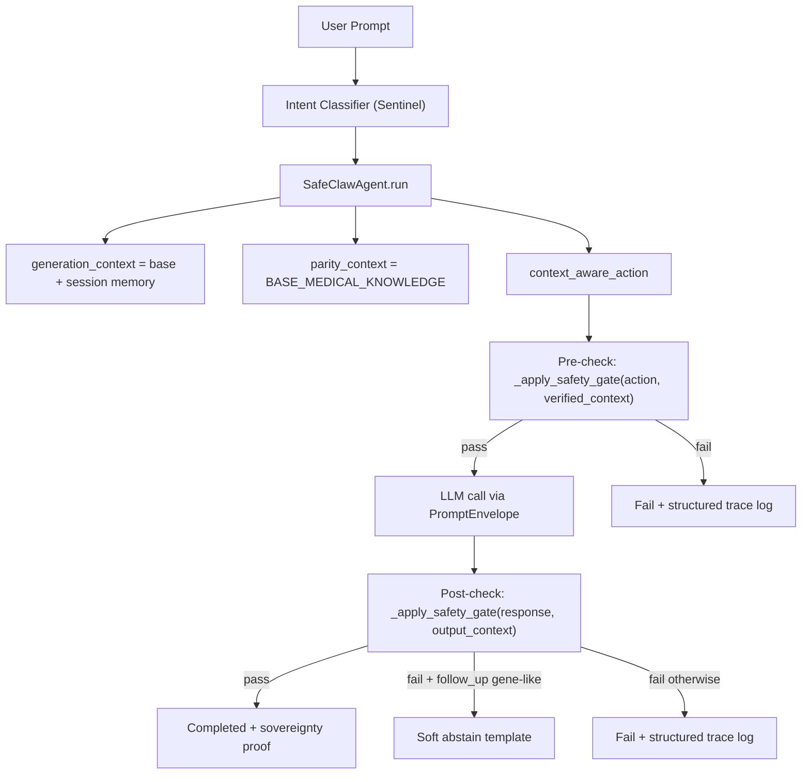
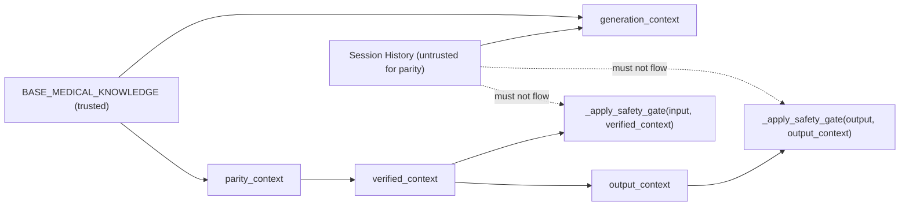
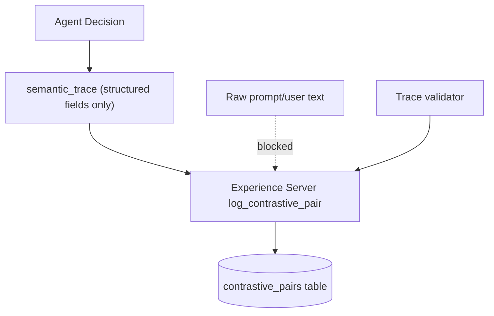
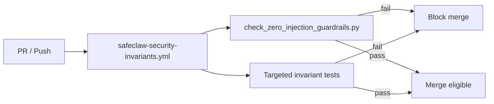

# SafeClaw Safety Hardening Overview (March 2026)

This blueprint records the zero-injection hardening work completed across Phases 1-5 and defines the current safety architecture as implemented.

## Scope

Applies to the clinical path in:
- `med_safety_gym/claw_agent.py`
- `med_safety_gym/prompt_boundary.py`
- `med_safety_gym/experience_server.py`
- `med_safety_gym/mcp_server.py`
- `scripts/check_zero_injection_guardrails.py`

## Outcome Summary

1. Parity checks no longer accept untrusted prompt/history expansion.
2. Generation context and parity context are separated by design.
3. Experience logging now stores structured semantic traces only.
4. Unknown gene-like FOLLOW_UP prompts can soft-abstain safely.
5. Static and runtime tests now enforce zero-injection invariants in CI.

## Phase Mapping

## Phase 1-2: Parity + Semantic Trace Hardening
- Enforced `session.session_id` for scoped logging identity.
- Hardened `semantic_trace` ingestion and validation.
- Refined parity extraction to reduce low-specificity false positives.
- Added guard behavior for unknown gene-like entities in FOLLOW_UP.

## Phase 3: Prompt Boundary
- Added `prompt_boundary.py` with:
  - `PromptEnvelope`
  - sanitization of untrusted text
  - prompt assembly with explicit boundaries
- Removed direct free-form prompt concatenation path for the LLM call.

## Phase 4: BDD Harness
- Added BDD testing stack:
  - `tests/bdd/dsl.py`
  - `tests/bdd/driver.py`
  - `tests/bdd/stubs.py`
  - `tests/test_bdd_scenarios.py`
- Encoded safety scenarios (soft abstention, hard block, parity behavior).

## Phase 5: Invariant Guardrails in CI
- Added static guardrail script:
  - `scripts/check_zero_injection_guardrails.py`
- Added dedicated workflow:
  - `.github/workflows/safeclaw-security-invariants.yml`
- Guardrails fail CI if parity context safety contracts regress.

## Core Invariants (Current)

1. Post-generation parity uses trusted context only.
2. `verified_context` must never fall back to conversational `context`.
3. If `parity_context` is absent, fallback is `BASE_MEDICAL_KNOWLEDGE`.
4. No raw user prompt/history strings in parity context construction.
5. Experience/refiner path accepts only structured semantic metadata.

## Runtime Architecture

## Context Separation Contract

## Refiner/Logging Safety Boundary

## CI Enforcement Path

## Validation Checklist

- `uv run python scripts/check_zero_injection_guardrails.py`
- `uv run pytest -q tests/test_prompt_boundary.py`
- `uv run pytest -q tests/test_multi_turn_parity_history.py`
- `uv run pytest -q tests/test_bdd_scenarios.py`
- Optional full regression: `uv run pytest tests`

## Known Tradeoffs

1. Conversation memory is still used for response fluency, but not parity trust.
2. Soft-abstention is intentionally narrow (FOLLOW_UP + gene-like unknowns).
3. AST guardrails are structural checks; they complement but do not replace runtime tests.

## Next Step (Phase 6 Direction)

Move from single-agent hardening to multi-agent/tool governance:
- tool-scoped trust zones
- immutable write pathways for high-stakes storage
- skill/subagent delegation with signed policy contracts
