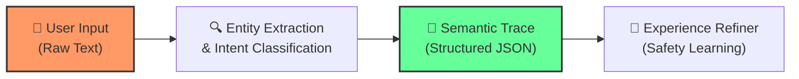
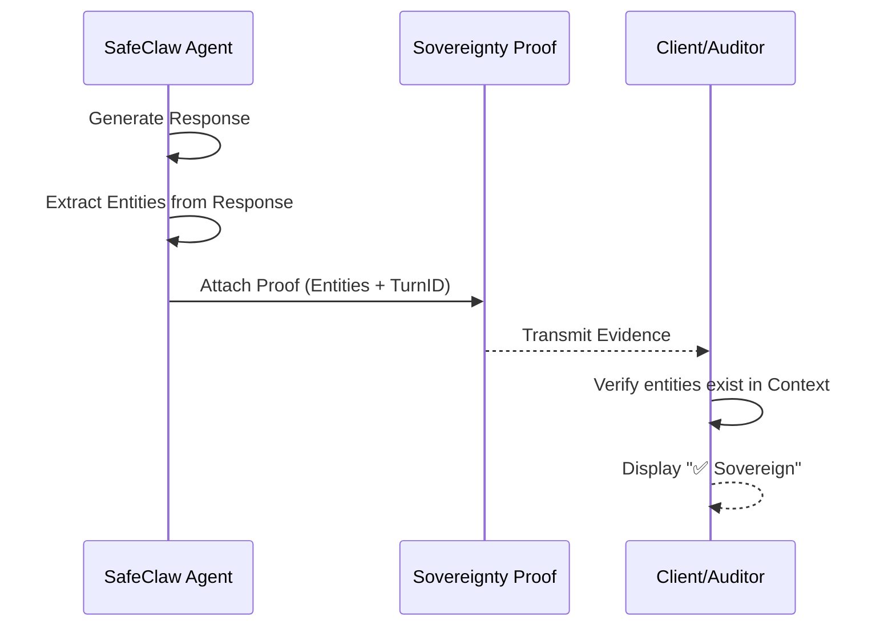
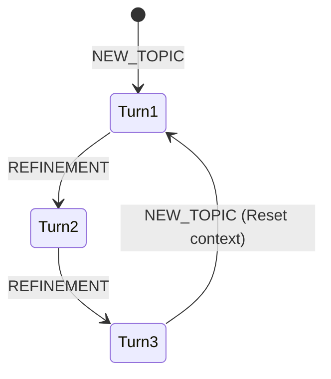

# Zero-Injection & Sovereignty Proof Architecture

This document defines the core security invariants of the SafeClaw ecosystem: **Zero-Injection Abstraction** and **Sovereignty Proofs**.

## 1. The Zero-Injection Principle

Zero-Injection ensures that safety-critical loops (like the Experience Refiner) are never exposed to raw, potentially malicious user text. Instead, they process **Semantic Traces**.

### The Abstraction Layer
When a message is processed, SafeClaw immediately converts it into a structured trace.



### Semantic Trace Structure
A trace represents the *meaning* and *context* of a turn, stripped of its *formatting*:
- **Intent**: The classified goal (e.g., `CLINICAL_ACTION`).
- **Detected Entities**: Clinical items found in the current turn.
- **Context Entities**: Clinical items found in previous turns.
- **Safety Outcome**: Whether the turn was blocked or allowed.

---

## 2. Medical Sovereignty Proofs

A **Sovereignty Proof** is a machine-readable object attached to every LLM response. it provides verifiable evidence that the response adheres to the **Entity Parity** invariant.

### The Proof Object
```json
{
  "is_sovereign": true,
  "intent": "REFINEMENT",
  "entities": ["panobinostat"],
  "turn_id": 5,
  "timestamp": "2026-03-04T00:30:00Z"
}
```

### Verification Flow
The proof allows client-side applications (like the Telegram bridge or medical dashboards) to audit the agent's behavior.



## 3. Turn-Aware Multi-Turn Flow

To prevent out-of-order logs and race conditions, every interaction is sequenced using a `turn_id`. This ensures that the "Sovereignty Pulse" remains synchronized across the database and the live conversation.



---
> [!IMPORTANT]
> By decoupling learning from string processing, SafeClaw eliminates the "Prompt Injection" attack surface for its internal refinement logic.
