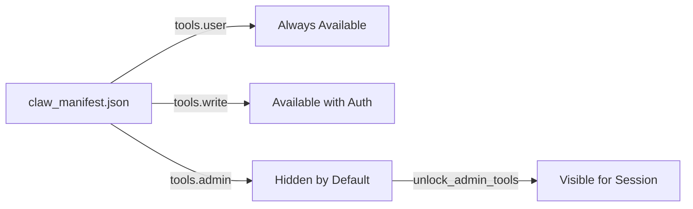
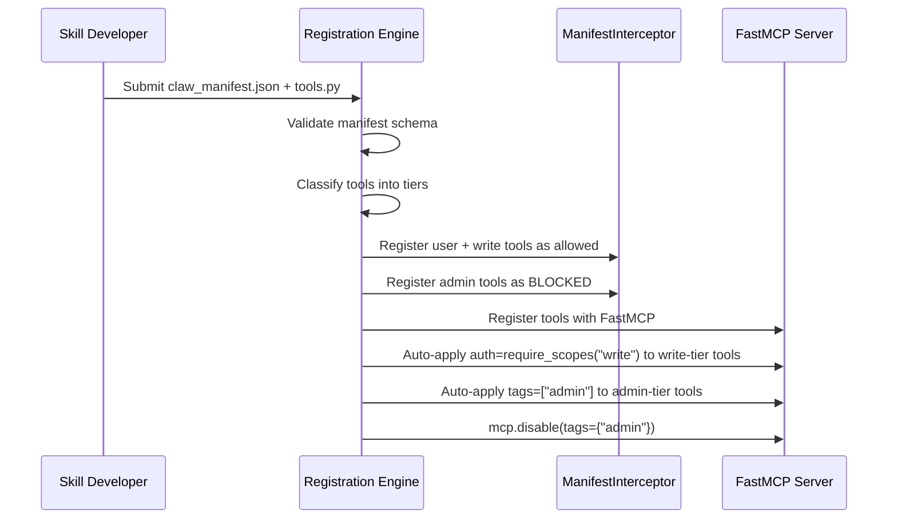
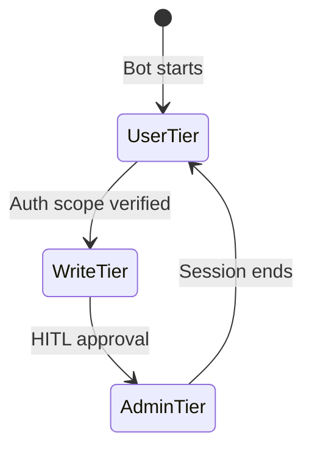

# Manifest Registration & Permission Tiers — Design Brainstorm

How SafeClaw handles skill registration, permission escalation, and the relationship between **manifests**, **FastMCP scopes**, and **visibility tags**.

---

## 1. The Core Problem

A user installs a "GitHub Skill" that exposes 6 tools:

| Tool | Risk Level | Who should access it? |
|---|---|---|
| `configure_repo` | Low | Any user |
| `list_issues` | Low | Any user |
| `list_pull_requests` | Low | Any user |
| `create_issue` | Medium | User with `write` scope |
| `delete_issue_comment` | **High** | Admin only, hidden by default |
| `unlock_admin_tools` | **High** | Explicit escalation trigger |

**Question**: When this skill is registered, how does SafeClaw know which tools are "user-level" vs "admin-level"? And how does it prevent the agent from using `delete_issue_comment` unless the user explicitly opts in?

---

## 2. The Answer: Tiered Permission Model

We extend `claw_manifest.json` to declare **permission tiers** per tool:

```json
{
  "name": "github-skill",
  "version": "1.0.0",
  "permissions": {
    "net": ["api.github.com"],
    "fs": ["./workspace"],
    "tools": {
      "user": ["configure_repo", "list_issues", "list_pull_requests"],
      "write": ["create_issue"],
      "admin": ["delete_issue_comment", "unlock_admin_tools"]
    }
  }
}
```

### How each tier works:



| Tier | Interceptor Behavior | FastMCP Server Behavior |
|---|---|---|
| `user` | Allowed immediately | No auth required, always visible |
| `write` | Allowed immediately | `auth=require_scopes("write")` enforced |
| `admin` | **Blocked** until escalated | `tags=["admin"]`, hidden via `mcp.disable()` |

---

## 3. Registration Flow: What Happens When a Skill is Installed



### Key Decisions During Registration:

1. **Schema validation** — Does the manifest have the required fields?
2. **Tier classification** — Are tools placed in `user`, `write`, or `admin`?
3. **Scope generation** — `write`-tier tools auto-get `require_scopes("write")`
4. **Visibility** — `admin`-tier tools auto-get `tags=["admin"]` and start hidden

---

## 4. Escalation: How a User Unlocks Admin Tools

The user types in Telegram:
```
gh: unlock admin tools
```

### What happens:

1. **Interceptor layer**: Agent checks if `unlock_admin_tools` is in the manifest's `admin` tier
2. **HITL confirmation**: Bot sends Telegram inline button: _"⚠️ Enable admin tools? This allows deleting comments."_ → `[Yes] [No]`
3. **If approved**: 
   - Interceptor temporarily adds admin tools to the session's allowed set
   - FastMCP `ctx.enable_components(tags={"admin"})` makes them visible
4. **Session-scoped**: Admin tools are only unlocked for THIS session. Next session starts fresh.



---

## 5. Auto-Generating Scopes from Manifest

The bridge between manifest tiers and FastMCP scopes:

```python
def generate_scope_config(manifest: SkillManifest) -> dict:
    """Derive FastMCP auth/visibility from manifest tiers."""
    config = {}
    tools = manifest.permissions.tools
    
    for tool_name in tools.get("user", []):
        config[tool_name] = {"auth": None, "tags": []}
    
    for tool_name in tools.get("write", []):
        config[tool_name] = {"auth": "write", "tags": []}
    
    for tool_name in tools.get("admin", []):
        config[tool_name] = {"auth": "admin", "tags": ["admin"]}
    
    return config
```

This config is used at registration time to:
- Apply `@mcp.tool(auth=require_scopes("write"))` decorators
- Apply `@mcp.tool(tags=["admin"])` visibility tags
- Call `mcp.disable(tags={"admin"})` to hide admin tools

---

## 6. Nooks & Crannies

### 6.1 What if a manifest declares a tool that doesn't exist on the server?
→ **Registration fails.** The registration engine validates that every tool in the manifest exists in the MCP server's tool registry. This prevents typos and mismatch attacks.

### 6.2 What if a tool has no tier in the manifest?
→ **Denied by default.** Any tool not explicitly listed in any tier is treated as if it doesn't exist. The interceptor blocks it. *Principle of least privilege.*

### 6.3 Can a skill escalate its own permissions?
→ **No.** The manifest is read-only after registration. A tool cannot modify its own manifest. The `unlock_admin_tools` flow is handled by the **agent/bridge layer**, not by the skill itself.

### 6.4 What about third-party skills with unknown tools?
→ **Sandbox first.** When a user installs a third-party skill:
1. Show the manifest's declared permissions (like Android install screen)
2. Run the skill in a sandboxed MCP server (Docker/Wasm) 
3. The sandbox enforces `claw_manifest.json` network/fs rules at the OS level
4. Even if the code tries to bypass the manifest, the sandbox blocks it

### 6.5 Can two skills have conflicting permissions?
→ **Union with least privilege.** If Skill A allows `api.github.com` and Skill B allows `api.weather.gov`, the combined network allowlist is both. But tool allowlists are **per-skill** — Skill A can't call Skill B's tools.

### 6.6 What about the audit trail?
→ **Already built.** The `ManifestInterceptor._audit()` method logs every allowed/blocked call. For admin escalation, we add a `"escalation"` entry with the user's Telegram ID and timestamp.

### 6.7 How does this work with the existing `SessionMemory`?
→ **Session-scoped tiers.** The interceptor's `audit_entries` are per-session. Admin escalation is stored in the session memory so it survives within a conversation but resets on bot restart.

### 6.8 Rate limiting for admin tools?
→ **Future work.** Admin tools could have a rate limit (e.g., max 5 deletes per session) enforced by the interceptor before the call reaches FastMCP.

### 6.9 How do we migrate the current flat `tools` list to tiers?
→ **Backward compatible.** If `permissions.tools` is a flat list (current format), treat all tools as `user` tier. If it's a dict with `user`/`write`/`admin` keys, use the tiered model. The `SkillManifest.from_dict()` handles both.

---

## 7. Implementation Phases

| Phase | Work | Complexity |
|---|---|---|
| **Now** | Auto-generate scopes from manifest + update `SkillManifest` for tiers | Medium |
| **Next** | HITL approval buttons for admin escalation via Telegram | Medium |
| **Later** | Skill registration engine + sandbox runtime | High |
| **Future** | Marketplace UI + manifest signing + reputation system | High |

---

## 8. Comparison: Before vs After

| Aspect | Before (Flat) | After (Tiered) |
|---|---|---|
| Tool access | All-or-nothing | `user` / `write` / `admin` |
| Admin tools | Manually hidden | Auto-hidden from manifest |
| Scope auth | Manually decorated | Auto-generated from tiers |
| Escalation | No path available | HITL unlock per-session |
| Audit | Basic logging | Tier-aware, user-attributed |
