# OpenClaw Redesign: A "Safe-by-Design" Architecture
**From "Wild West" to "Invariant-Driven" Autonomy**

## 1. Executive Summary & The "Why"
OpenClaw (180k+ stars) proved that developers want **Local, Chat-Native, Action-Oriented** agents. However, its "glue code" architecture (one hour to prototype) led to a security crisis: RCEs, malicious skills, and silent data exfiltration.

We propose **"SafeClaw"** (working title): A novel agent architecture that preserves the viral utility of OpenClaw (Telegram, Local Tools) but enforces **Strict Safety Invariants** derived from our `med-safety-gym` research.

**The Core Shift:**
*   **Old**: "If the LLM outputs a command, execute it." (Vibe-based safety)
*   **New**: "If the command passes **Entity Parity** and **Rubric Verification**, execute it. Otherwise, **Block & Alert**." (Invariant-based safety)

---

## 2. Diagnosis: Why OpenClaw Failed Security
Based on the `project_context_digest.md` and `outside.md`, OpenClaw's failures are structural:

| Failure Mode | OpenClaw Cause | Med-Safety-Gym Solution |
| :--- | :--- | :--- |
| **RCE / Hijacking** | Trusted `gatewayUrl` in query string; no WebSocket auth. | **FastMCP + OpenEnv**: Strict protocol handshake; no "implicit trust." |
| **Malicious Skills** | "What Would Elon Do?" skill `curl`'d data silently. | **Action Parity**: A skill cannot introduce an "Action Entity" (e.g., `curl`) that isn't in the **Allowlist Rubric**. |
| **Prompt Injection** | Email/Message contents can override system prompts. | **Invariant Layer**: Safety logic sits *outside* the LLM context (in code), so prompts cannot override it. |
| **Shadow AI** | Users running 24/7 agents with root access. | **Sandboxed Runtime**: Tools run in ephemeral containers (Docker/Wasm) with strict resource limits. |

### 2.1 The "SKILL.md" Vulnerability
Our analysis of `.agents/skills` reveals a critical flaw: **Skills are just Prompts**.
*   Files like `merge-pr/SKILL.md` are natural language instructions telling the agent to run generic tools (e.g., `bash`).
*   **Risk**: There is no code-level enforcement. An injected prompt can ignore the `SKILL.md` instructions and use the same `bash` access to execute malicious commands.
*   **Conclusion**: We must deprecate Prompt-based Skills in favor of **Code-based Tools** (MCP).

---

## 3. The "Safe-by-Design" Implementation Plan

### Phase 1: The "Guardian" Gateway (Telegram Integration)
Instead of a direct "LLM -> Shell" loop, we introduce a **Guardian** middleware.

**Architecture:**

```mermaid
graph TD
    User((User)) -->|Telegram| Bot["Telegram Bot Interface"]
    Bot -->|Msg| Guardian["🛡️ Safety Guardian"]
    Guardian -->|Sanitized Prompt| LLM["Model (M2.5/Claude)"]
    LLM -->|Tool Call| Guardian
    
    Guardian -->|"Verify: Entity Parity"| Rubric{Check Rubric}
    Rubric -->|Pass| Tool["🛠️ Tool Execution"]
    Rubric -->|Fail| Alert["🚨 Security Alert"]
    
    Tool -->|Result| Guardian
    Guardian -->|Response| Bot
```


**Key Features:**
1.  **Telegram-First**: We start with Telegram (as you suggested). It’s the perfect UI because it supports **Approvals** (Yes/No buttons) natively.
2.  **The "Parity" Check**:
    *   In `med-safety-gym`, we checked `Drug Entites`.
    *   In SafeClaw, we check **Action Entities**.
    *   *Example*: If a "Weather Skill" tries to `read_file('/etc/passwd')`, the **Entity Parity** logic sees that `/etc/passwd` is NOT in the "Weather Context." **BLOCKED.**

### Phase 2: Replacing `SKILL.md` with MCP & Invariants
We move from "Prompt Instructions" to "Strictly Typed Tools".

1.  **Deprecate `SKILL.md`**: No more "Please run git".
2.  **Adopt FastMCP**: Create granular tools like `git_merge_pr` that *only* execute specific logic.
3.  **Apply Rubrics**: Port `DIPGRubric` to check these tools.

We port the `DIPGRubric` logic to general purpose actions.

**The "General Purpose" Rubric:**
*   **Invariant 1: No Silent Network Calls.**
    *   *Rule*: All `http` requests must match a whitelist of domains (e.g., `api.weather.gov`). Any `curl` to an unknown IP is blocked.
*   **Invariant 2: File System Jail.**
    *   *Rule*: Agent can only R/W in `./workspace`. Any path containing `..` or absolute paths `/` is blocked by the **Guardian Code** (not the LLM).
*   **Invariant 3: Confirmation Parity.**
    *   *Rule*: High-stakes actions (delete file, email send) require **Human-in-the-Loop** (HITL) confirmation via Telegram Button.

### Phase 3: "Agentic Vision" for Terminal Auditing
We re-use our **Gemini Vision** work. 
*   Before executing a high-stakes terminal command, the agent **renders the command** to an image (or takes a screenshot of the terminal state).
*   A separate "Safety Model" (Vision) looks at the screenshot.
*   *Prompt*: "Does this command look like it might delete system files?"
*   This prevents "hidden text" attacks where malicious characters are hidden in ANSI codes.

---

## 4. Bootstrapping Strategy (The "Novel" Approach)

We don't fork OpenClaw. We build **"ClawSafe"** (or similar) from scratch using **FastMCP**.

**Why FastMCP?**
*   OpenClaw uses a custom, messy glue-code architecture.
*   FastMCP (Model Context Protocol) is the standard.
*   We build a **FastMCP Server** that exposes *safe* tools.
*   We build a **Telegram Client** that connects to this MCP server.

**Step-by-Step implementation:**
1.  **Repo Init**: New repo `claw-safe` (or inside `med-safety-gym-v2/experimental`).
2.  **Core**: A `FastMCP` server exposing `bash` (sandboxed) and `browser` (headless).
3.  **Safety Layer**: A `RubricInterceptor` that wraps every tool call.
    *   Implements `check_entity_parity(tool_args)`.
4.  **UI**: A simple Python `python-telegram-bot` script that creates a session.

## 6. The New Marketplace: Verifiable Capabilities
How do users share skills if they can't upload arbitrary `bash` scripts?

We adopt the **"Manifest + Permission"** model (like Android/iOS/Chrome Extensions).

### Structure of a "SafeClaw Skill" Package
A `.zip` or Git repo containing:
1.  **`claw_manifest.json`**: Declares required permissions.
    ```json
    {
      "name": "weather-skill",
      "permissions": {
        "net": ["api.weather.gov"],
        "fs": ["./workspace/weather-cache.json"]
      }
    }
    ```
2.  **`tools.py` (FastMCP)**: The actual Python code implementing the tools.
    *   *Constraint*: Can only import whitelisted libraries (`httpx`, `pydantic`).
    *   *Runtime*: Executed in a **Wasm/Docker Sandbox** that enforces the `claw_manifest.json` network/fs rules.
3.  **`prompts.yaml` (Optional)**: System prompt augmentations (e.g., "You are a meteorologist"). *These are advisory, not binding.*

### The Marketplace Experience
*   **User**: Browse "Weather Skill".
*   **UI**: "This skill wants to access `api.weather.gov`. Allow?"
*   **Runtime**: If the code tries to `curl google.com`, the **Sandbox** blocks it because it wasn't in the manifest.

## 7. Comparison: OpenClaw vs. Our Proposal

| Feature | OpenClaw (Current) | Our Proposal (SafeClaw) |
| :--- | :--- | :--- |
| **Tool Execution** | Direct, Trusted | **Intercepted, Rubric-Checked** |
| **Skills** | Arbitrary Python/Bash Scripts | **Sandboxed MCP Tools** |
| **Safety** | "Prompt System Instructions" | **Code-Level Invariants** |
| **Marketplace** | Unverified Zip files | **Signed, Parity-Checked Manifests** |
| **UI** | Custom React App (Vulnerable) | **Telegram/WhatsApp (Secure Platform)** |

## 8. Conclusion


We adopt the **"Manifest + Permission"** model (like Android/iOS/Chrome Extensions).

### Structure of a "SafeClaw Skill" Package
A `.zip` or Git repo containing:
1.  **`claw_manifest.json`**: Declares required permissions.
    ```json
    {
      "name": "weather-skill",
      "permissions": {
        "net": ["api.weather.gov"],
        "fs": ["./workspace/weather-cache.json"]
      }
    }
    ```
2.  **`tools.py` (FastMCP)**: The actual Python code implementing the tools.
    *   *Constraint*: Can only import whitelisted libraries (`httpx`, `pydantic`).
    *   *Runtime*: Executed in a **Wasm/Docker Sandbox** that enforces the `claw_manifest.json` network/fs rules.
3.  **`prompts.yaml` (Optional)**: System prompt augmentations (e.g., "You are a meteorologist"). *These are advisory, not binding.*

### The Marketplace Experience
*   **User**: Browse "Weather Skill".
*   **UI**: "This skill wants to access `api.weather.gov`. Allow?"
*   **Runtime**: If the code tries to `curl google.com`, the **Sandbox** blocks it because it wasn't in the manifest.

## 7. Comparison: OpenClaw vs. Our Proposal
You are right. We should not just "plug" `med-safety-gym` into OpenClaw. The OpenClaw foundation is rotten (security-wise). 

Instead, we **re-build the Agent Runtime** using our `med-safety-gym` philosophies:
1.  **Entity Parity** -> **Action Allowlisting**
2.  **Rubrics** -> **Policy Enforcement**
3.  **Vision Loop** -> **Visual Audit**

This allows us to capture the "Viral Utility" (Telegram Agent) while solving the "Security Nightmare." We start small: A Telegram bot that can *safely* check GitHub and summarize files, enforcing invariants that OpenClaw failed to build.
