# SafeClaw Multi-Turn Strategy: From Governor to Governed Agency

> A strategic roadmap synthesizing [bench_1.md](./bench_1.md) (CMU Multi-Turn Survey), [bench_2.md](./bench_2.md) (Intent Mismatch / Mediator), [sub.md](./sub.md) (Six-Layer Context Engineering), and the existing [SafeClaw Blueprint](./).

---

## 1. Executive Diagnosis: Where We Are vs. Where the Field Is

### What We Have ✅

| Layer | Component | Status | File |
|:---|:---|:---|:---|
| **Governor** | Hub + Ed25519 + Tiered Manifest | Operational | [claw_agent.py](../med_safety_gym/claw_agent.py) |
| **Interceptor** | `_verify_and_gate_tool_call` + Entity Parity | Operational | [claw_agent.py](../med_safety_gym/claw_agent.py#L424-L468) |
| **Session Memory** | Per-user message history + medical entity extraction | Basic | [session_memory.py](../med_safety_gym/session_memory.py) |
| **Telegram UI** | HITL via buttons, bot gateway | Bootstrap | Telegram integration |
| **Secrets** | Keychain migration (Phase 43) | In PR | [secret_store.py](../med_safety_gym/identity/secret_store.py) |

### What We're Missing ❌ (Research-Backed Gaps)

| Gap | Evidence (Paper) | Impact |
|:---|:---|:---|
| **No Intent Classification** | bench_2 §3: ~60% degradation is *structural* — scaling models doesn't fix it | Users' multi-turn messages are treated as flat text; no separation of intent inference from task execution |
| **No Mediator Pattern** | bench_2 §4: Mediator-Assistant architecture recovers 20%+ performance | Our `claw_agent.run()` conflates understanding *what* the user wants with *doing* it |
| **No Experience Refiner** | bench_2 §4.2: Contrastive pair distillation into pragmatic guidelines | No learning from failed interactions; no contrastive trajectory analysis |
| **Flat Memory** | bench_1 §3.2: KG > Vector RAG for relationship tracking | `SessionMemory` is a message list with simple entity extraction — no graph structure |
| **No Proactive Seeking** | bench_1 §4.2.3: LLMs are "largely reactive" | Agent never asks clarifying questions; responds immediately to underspecified medical queries |
| **No Multi-Turn RL** | bench_1 §3.1.3: DMPO, ArCHer, REFUEL outperform single-turn RLHF | Our GRPO training is single-turn; no trajectory-level optimization |
| **No Context Scoping** | Blueprint `SAFER_OPENCLAW_ROADMAP.md` §5.B | Escalated sessions share context with base sessions — "Context Leak" risk |

---

## 2. The Core Insight: Intent ≠ Execution

bench_2's key theoretical finding is that multi-turn performance degrades because of an **alignment gap**, not a capability gap:

```
P(R | Ct) = Σ P(R | It) · P(It | Ct)
              ─────────  ───────────
              Execution   Inference
              (stable)    (degrades)
```

> [!IMPORTANT]
> **Scaling model size only sharpens the prior to the "average user."** The ~60% degradation is *constant* across GPT-4o-mini, GPT-5.2, and DeepSeek-v3.2-Thinking. This means SafeClaw cannot rely on upgrading the LLM — we must architecturally decouple intent from execution.

This maps directly to `sub.md`'s six layers:

| sub.md Layer | SafeClaw Current | Needed |
|:---|:---|:---|
| **Instructions** | System prompt in `claw_agent.py` | Intent-classified, role-aware instructions |
| **Examples** | None | Contrastive pairs (bench_2's D⁺/D⁻) |
| **Knowledge** | Medical entity extraction | Domain KG + Action Allowlist |
| **Memory** | `SessionMemory` (list of dicts) | Episodic + Hierarchical (MemTree, COMEDY) |
| **Tools** | MCP tools via `FastMCP` | Governor-scoped, JIT-escalated tools ✅ |
| **Tool Results** | Passed back to LLM | Needs contrastive feedback loop + self-correction |

---

## 3. Phased Roadmap

### Phase 40 & 41a: Foundation (Current Status)

**Goal**: Establish base Identity, Authorization (the Gateway), and Security to safely enable multi-turn workflows.
- **Phase 40**: Sovereign Hub, Scoped Manifests, and Delegation Tokens (Operational)
- **Phase 41a**: Secure Local Keyring Integration (In PR)

---

### Phase A (Multi-Turn): The Mediator (Weeks 1–2) 🎯 *This Week + Next*

**Goal**: Decouple intent inference from task execution in `SafeClawAgent.run()`.

```mermaid
graph LR
    User[Telegram User] --> Mediator["🧠 Mediator<br/>(Intent Classifier)"]
    Mediator --> |"Û (explicit instruction)"| Agent["🤖 Assistant<br/>(SafeClawAgent)"]
    Agent --> |"Tool Call"| Interceptor["🛡️ Interceptor"]
    Interceptor --> Tool["🛠️ MCP Tool"]

    subgraph Experience["📚 Experience Store"]
        Refiner["Refiner"]
        Contrastive["D⁺/D⁻ Pairs"]
    end

    Mediator -.-> |"ℰ (guidelines)"| Experience
```



#### Concrete Steps

1. **Intent Classifier Module** — New file: `med_safety_gym/intent_classifier.py`
   - Classify each user message into: `follow_up`, `refinement`, `expansion`, `recollection`, `new_topic` (taxonomy from bench_1 MT-Eval §2.1)
   - Map classification to whether the message is a *correction* vs *confirmation* of the previous assistant assumption (bench_2's key failure mode)
   - Lightweight: rule-based first (regex + keyword), then LLM-based for ambiguous cases

2. **Mediator Wrapper** — Modify `SafeClawAgent.run()`
   - Before dispatching to the LLM, pass `(Ct, ℰ)` through a Mediator prompt that produces `Û` (a fully-specified instruction)
   - The Mediator is a separate system prompt, not the same as the assistant's
   - Start with a simple template: `"Given the conversation history and these guidelines, rewrite the user's latest message as a complete, self-contained instruction."`

3. **Context Scoping** — Implement in `SessionMemory`
   - When a session is escalated (admin/critical tier), create a *fresh sub-session*
   - When de-escalated, purge the escalated context (prevents "Context Leak" from [SAFER_OPENCLAW_ROADMAP.md](./SAFER_OPENCLAW_ROADMAP.md#L57))

---

### Phase 41 + Phase B: Experience Refiner & Structured Memory (Weeks 3–4)

**Goal**: Learn from failed interactions and build relational memory.

#### Experience Refiner

1. **Contrastive Pair Collection** — Log successful vs. failed interaction trajectories
   - `D⁺` = user eventually got the right answer (successful session)
   - `D⁻` = session where the agent misunderstood (flagged by user correction or negative feedback)
   - Store in SQLite alongside existing `ConversationSession` table

2. **Refiner Module** — New file: `med_safety_gym/experience_refiner.py`
   - Takes `(D⁻, D⁺)` pairs and distills them into pragmatic guidelines (bench_2 §4.2)
   - Example output: `"When the user says 'what about X', they are correcting the previous drug choice, not asking for additional information about it."`
   - Guidelines stored as structured text, injected into Mediator's system prompt

#### Structured Memory (KG Lite)

1. **Entity Graph** — Evolve `SessionMemory._extract_medical_entities()` into a proper graph
   - Nodes: medical entities (drugs, conditions, procedures)
   - Edges: relationships (`treats`, `contraindicates`, `prescribed_for`, `replaces`)
   - Use existing `_extract_medical_entities()` as the entity source; add relation extraction
   - Start with `networkx` (in-memory graph), later Cognee or Neo4j

2. **Graph-Backed Context** — Before each LLM call, traverse the entity graph to produce structured context
   - Replace flat `get_medical_context()` with graph-aware context that includes *relationships*
   - Addresses bench_1 §3.2.3: "Vector RAG = relationship blindness" — our current entity set has no edges

---

### Phase C (Multi-Turn): Multi-Turn Training + Proactive Seeking (Month 2)

**Goal**: Train the model to be better at multi-turn and to ask questions when it should.

#### Multi-Turn RL

| Technique | Source | Application to SafeClaw |
|:---|:---|:---|
| **DMPO** (Direct Multi-Turn Preference Optimization) | bench_1 §3.1.3 | Extend GRPO training to optimize entire conversation trajectories, not just single responses |
| **ArCHer** (Hierarchical RL) | bench_1 §3.1.3 | Two-level: high-level manages turn-granularity, low-level generates tokens |
| **REFUEL** (Off-Policy Value) | bench_1 §3.1.3 | Train Q-value function on accumulated session trajectories |

> [!NOTE]
> Our current `train_grpo_tpu.py` does single-turn GRPO. The simplest upgrade path is DMPO — it's a direct extension of DPO to multi-turn trajectories, which we can apply to our existing `CMtMedQA`-style data by constructing trajectory-level preference pairs.

#### Proactive Information Seeking

1. **Confidence-Aware Response Generation (CARG)** — bench_1 §2.1.1
   - Before generating a response, estimate confidence in the inferred intent
   - If confidence < threshold, generate a clarifying question instead of an answer
   - Medical domain is *ideal* for this: "I feel sick" → ask targeted symptoms (bench_1 §2.2.2)

2. **Abstention-as-Safety** — Align with existing `med_safety_eval` abstention logic
   - If entity parity check shows missing entities, ask rather than hallucinate
   - Links to our existing rubric work: `DIPGRubric` already checks for entity coverage

---

### Phase 42 & 43 + Phase D: Full Agent Architecture (Month 3+)

**Goal**: Scale to multi-agent, parallelism, and full Knowledge Graph integration.

```mermaid
graph TD
    subgraph "SafeClaw v2 Architecture"
        User[Telegram User] --> Mediator
        Mediator --> Orchestrator
        Orchestrator --> |"spawn"| Worker1["🔬 Research Worker"]
        Orchestrator --> |"spawn"| Worker2["📝 Writing Worker"]
        Orchestrator --> |"spawn"| Worker3["🔍 Safety Auditor"]

        subgraph "Governance Layer"
            Governor["🏛️ Governor Hub"]
            KG["🗺️ Knowledge Graph"]
            Experiences["📚 Experience Store"]
        end

        Governor --> |"scoped manifest"| Worker1
        Governor --> |"scoped manifest"| Worker2
        Governor --> |"scoped manifest"| Worker3
        KG --> Mediator
        Experiences --> Mediator
    end
```



#### Key Components

1. **Subagent Spawning** — from [MEMORY_AND_PARALLELISM_STRATEGY.md](./MEMORY_AND_PARALLELISM_STRATEGY.md)
   - Governor decides if the Orchestrator can spawn subagents based on current tier
   - Each subagent gets an isolated context subgraph ("Memory Isolation")
   - Only `Admin+` can spawn subagents (prevents "Spawning Hazard")

2. **Full Knowledge Graph** — Cognee or Neo4j
   - Entity extraction after every tool call (Phase 41 from blueprint)
   - Graph-backed recall before every task (Phase 42 from blueprint)
   - Subagent isolation: each worker has its own subgraph, merged safely on completion

3. **Agentic Vision** — Terminal auditing via Gemini Vision (Phase 3 from `openclaw_safety_redesign.md`)
   - Before high-stakes commands, screenshot + Vision safety check
   - Prevents ANSI-code hidden text attacks

---

## 4. How This Maps to sub.md's Six Layers

| Layer | Phase A | Phase B | Phase C | Phase D |
|:---|:---|:---|:---|:---|
| **Instructions** | Intent-classified Mediator prompts | User-specific pragmatic guidelines | Confidence-gated instructions | Multi-agent role instructions |
| **Examples** | — | Contrastive D⁺/D⁻ pairs | Trajectory-level preference pairs | — |
| **Knowledge** | Entity Parity (existing) | Entity Graph (networkx) | Domain KG + Rubric integration | Full KG (Cognee/Neo4j) |
| **Memory** | Context Scoping | Episodic memory + graph | Multi-turn state tracking | Memory Isolation per subagent |
| **Tools** | Governor-scoped MCP tools | + Experience Refiner tool | + Proactive question tool | + Subagent spawning |
| **Tool Results** | Pass-through | Contrastive feedback logging | Self-correction via CARG | Subgraph merge |

---

## 5. Success Metrics

| Metric | Current | Phase A Target | Phase D Target |
|:---|:---|:---|:---|
| **Multi-Turn Intent Accuracy** | Not measured | >70% (via intent classifier eval) | >90% |
| **LiC Recovery** | 0% (no Mediator) | +15% (bench_2 baseline) | +25% |
| **Entity Parity (graph-aware)** | Flat set comparison | Relationship-aware comparison | Full KG traversal |
| **Proactive Clarification Rate** | 0% (never asks) | N/A | >30% on ambiguous queries |
| **Context Leak Incidents** | Unknown | 0 (via Context Scoping) | 0 |
| **Subagent Safety** | N/A | N/A | 100% governor-approved spawns |

---

## 6. Immediate Actions (This Week)

- [ ] Create `med_safety_gym/intent_classifier.py` with MT-Eval taxonomy
- [ ] Add `classify_intent()` call at the top of `SafeClawAgent.run()`
- [ ] Implement Mediator prompt template (separate from assistant system prompt)
- [ ] Add `context_scope` field to `SessionMemory` for escalation isolation
- [ ] Begin logging contrastive pairs (success/failure) in `ConversationSession`

## 7. Next Week

- [ ] Build `med_safety_gym/experience_refiner.py` with contrastive pair distillation
- [ ] Add entity graph edges to `SessionMemory._extract_medical_entities()`
- [ ] Wire Mediator → Agent pipeline in Telegram bot flow
- [ ] Write tests for intent classification + Mediator output quality

---

## References

| Key Paper | Relevance to SafeClaw |
|:---|:---|
| **bench_1** (Li et al., 2026) — "Beyond Single-Turn: Survey on Multi-Turn LLM Interactions" | Comprehensive taxonomy of improvements: ICL, SFT, RL, memory, KG, agents |
| **bench_2** (Liu et al., 2026) — "Intent Mismatch Causes LLMs to Get Lost" | Mediator-Assistant architecture; ~60% constant degradation; experience-driven alignment |
| **MT-Eval** (Kwan et al., 2024) | Intent taxonomy: follow-up, refinement, expansion, recollection |
| **ArCHer** (Zhou et al., 2024) | Hierarchical RL for multi-turn credit assignment |
| **REFUEL** (Gao et al., 2025) | Off-policy value optimization for long dialogues |
| **CARG** (Li et al., 2025) | Confidence-aware response generation for consistency |
| **Cognee** | Knowledge Graph augmentation for agent memory |
