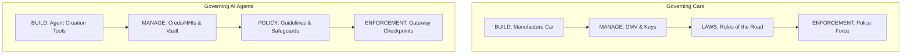
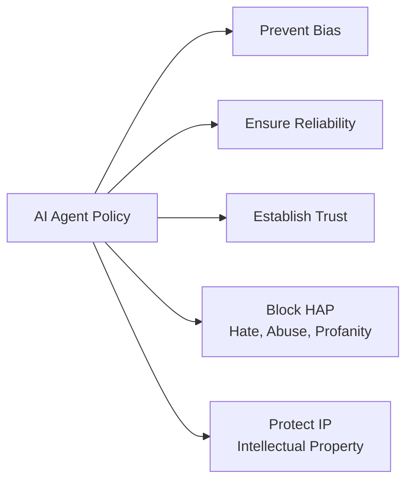
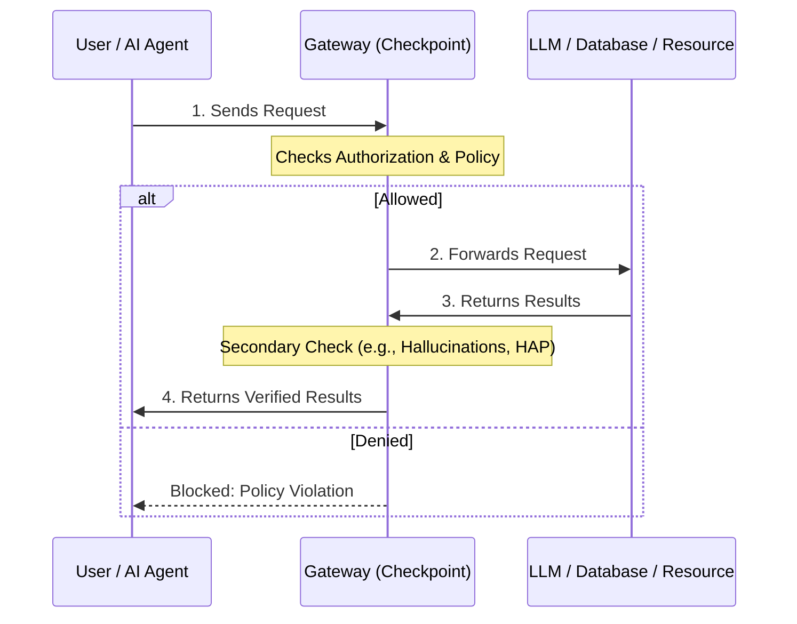

Here is the full transcript of the video, followed by Mermaid diagrams illustrating the key concepts discussed by the speaker.

### Transcript

"I remember when I first took the test to get a driver's license approximately a thousand years ago. The handbook said driving a car is a privilege, not a right. As a society, we've developed an infrastructure to govern and secure the way that we exercise that privilege in order to keep us all safe. AI agents need something similar if we're going to keep these autonomous systems from running amok. In fact, there are some parallels that we can draw from what we know in the world of governing vehicles that can be applied to governing agents. In this video, we're going to explore this example to see how we can keep our AI agents in their respective lanes and not have them swerving all over the road.

So let's use that analogy of a car and apply it to agents and figure out what kinds of policies and tools and things like that we need in order to govern those. So we'll start with the cars. So first of all, you're going to build a car. Well, probably you won't build it, somebody else will build it for you, but you're going to get a bunch of cars. And then you're going to take that car and some other things have to happen. Now once we've got the vehicle, we have to figure out how to manage all of this infrastructure around it. Specifically, who gets to drive and who doesn't. So one of the things we have in various jurisdictions is something like a Department of Motor Vehicles. So this is the group that's going to issue the driver's licenses. So you've got to go to them and prove who you are. So they have to authenticate you and then pass the test and assure that you're in fact responsible enough to have this. Then you're going to go and get keys. Well, you need a key if you're going to drive the car, of course. So you're going to have that, that'll come with the car. But sure, you've got to have some way to have the keys and some place to keep them, right? Then we're going to have laws that say what are the things that you can do with your car? What's the proper behavior, what's improper behavior, what are the consequences, all of those kinds of things. But basically these sort of governing principles that need to go around the operation of the vehicle. And then finally, we need to have some sort of enforcement of those rules. So we're going to have a police force. Some sort of group that's out there making sure that all of these boxes are checked and that these things are happening in the way we expect them to happen so that everyone stays safe on the roads.

Okay, that's the example with cars. Now let's get those out of here and let's talk about AI agents. Now in AI agents, first of all, you need some capability to build these. And the good news is there are a lot of tools that can do this. So you're going to use something that's designed to create agents so that you don't have to build those from scratch, just like you don't want to have to build your car from scratch. So use one of those tools to build your agents. Now we're going to move over here. What's the analogy to the DMV? Well, all of these agents that are going to be popping up over here, they need credentials. They're going to need to perform different functions. They're going to operate autonomously after all, so they're going to log into systems, they're going to perform particular operations. We need to make sure that those agents are in fact authorized to do what they're trying to do. So that means we're going to need a bunch of non-human identities, NHIs. These non-human identities will be populating all over the place. There's going to be a ton of them. And we're going to have to manage them. We're going to need tools that issue credentials to these agents and manage all of those to first of all authenticate that the agent is authorized to do certain things or not, and then ultimately manage all of those credentials. Then in our car analogy, we had the keys. Well, you probably just put your car keys on the shelf or by the counter as you leave, but think about this example where we've got tons of agents, therefore tons of cars, and therefore tons of keys. We've got lots of keys now that have to be managed. And what I need is a secure place to store all of those keys. I need a vault. A place that I can put all of those things in, I can put them in, I can check them out as I need to, and have a secure place that those all are kept. So that's another capability that also is needed for these agents.

Then we start looking at the sort of governance aspect of all of this. The laws. Analogy here, we're going to use policies for these agents. What kinds of things should they be allowed to do and what kinds of things shouldn't they be allowed to do? We're going to try to assure against things like bias. It's no good if our system starts getting particular ideas and starts biasing towards certain types of data and can't recognize other types of data or certain use cases and things like that. So I need to be able to detect drift in the system after it's initially created as well. I need to make sure that it's reliable. That I can rely on the results that come out of it. If this AI agent is based on an LLM, a large language model that hallucinates, then it's not reliable. So I need to be able to check its results and make sure that they are in fact explainable, reliable, and things like that. I need to make sure ultimately that it's a system I can trust. That it's a trustworthy agent. And therefore I've got the bounds around it to ensure that. I need to guard against hate, abuse, and profanity. Turns out it's bad for business if your AI cusses out your customers or does objectionable things. The same thing will be true of these agents. They're going to be running autonomously. So the things that they do, they can do at light speed. A person might make a mistake, an agent can make hundreds, thousands, millions of these maybe before someone catches it. So we've got to really have a tight governance around those. And then looking at intellectual property. The information that I have in this, I want to make sure that it's not compromised as well. So a lot of different things that I have to look at here in terms of the policy that we're going to apply to agents as well.

Then we need an enforcement layer. I need to make sure that I set up all of these rules and that somebody's actually making sure it happens. Because a rule is not a rule if there's not a punishment or some sort of guideline to keep you in the straight and narrow. So an enforcement capability for an AI agent may be if I have a user who is asking to do something or this could be an agent that's trying to do something and it wants to access a large language model. Well, one of the things I could do is put a gateway in between the two so that the user or AI agent in this case is having to first go through a layer, a checkpoint. And that checkpoint is going to say, are you allowed to do this or not? Is what you're trying to do something that's proper or not? Then if it is, we allow it to go through, hit the LLM or in some cases hit some other resource, some database, some service that we're calling, something like that where it's interacting with other parts of the system. And then when the results come back, I might want to check it one more time before the results are returned to the agent in this case. So you can see what we've done is carried through the analogy of building, of issuing credentials, of storing secure credentials and keys, also adding policy, and then enforcing all of that policy.

Just as we know from our experience with governing the use of cars, there are a lot of things to consider and a lot of parts to the system that need to work together as an integrated whole. The same is true for governing and securing AI agents to make sure that they aren't hijacked and controlled by attackers or just run off the rails inadvertently. The good news is that tools exist to do all the things I've talked about here, all the way from building agents to managing their identities, storing their credentials securely, building policies that can be monitored, updated, and ultimately enforced. If you want to know more about some of these tools, check out the links in the description below. That way you can keep your agents on the road and on their way to the destination of your choosing rather than the attackers'."

***

### Mermaid Diagrams

#### 1. Governance Analogy: Cars vs. AI Agents
This diagram illustrates the parallel governance frameworks the speaker draws between physical vehicles and autonomous AI agents.

#### 2. AI Agent Policy Components
This diagram breaks down the specific components written under the "Policy" (Laws) section of the whiteboard.

#### 3. AI Agent Enforcement Workflow
This sequence diagram shows the technical enforcement capability described at the end of the video, where a gateway acts as a checkpoint for requests and responses. 

