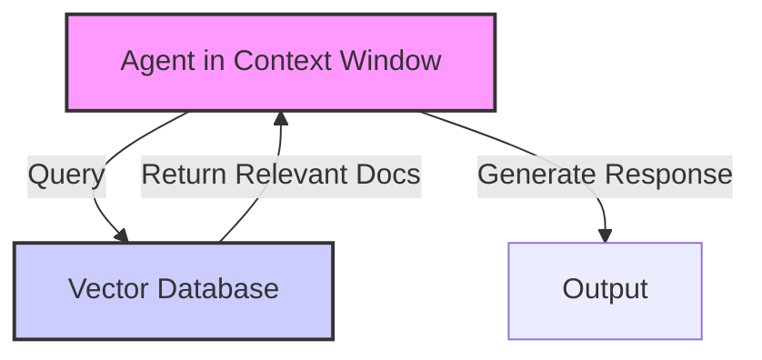
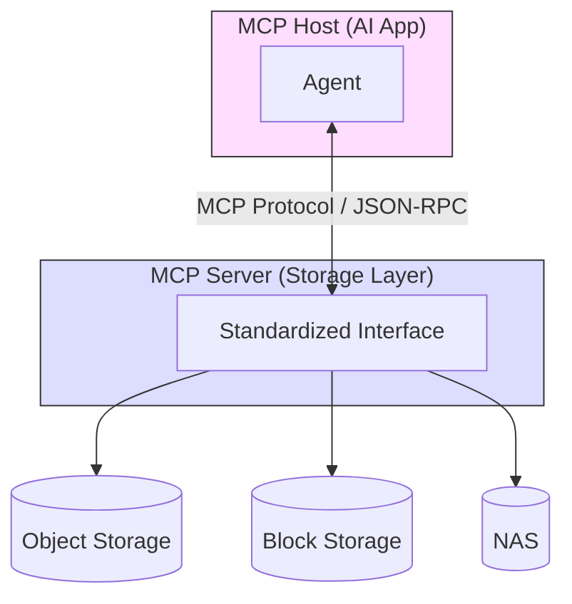
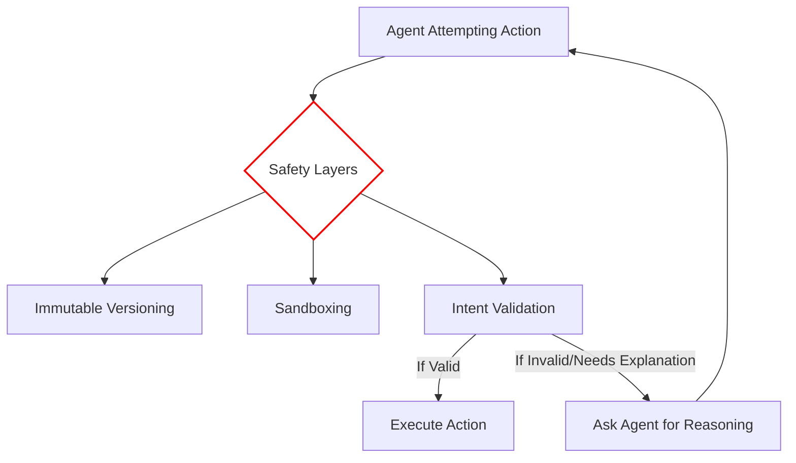

This video provides an overview of **Agentic Storage** and how it integrates with AI through the **Model Context Protocol (MCP)**. Below is the transcript and the corresponding diagrams for your exploration.

### Video Transcript

**(00:00) Introduction**
"What is Agentic Storage, and why do we need it? Well, Agentic AI systems, they're powered by LLMs, large language models, but they're not chatbots. They're systems that actually go out and do work autonomously, like write code and remediate incidents."

**(00:20) The Challenge: Statelessness and RAM**
"And LLMs are essentially stateless entities. When you spin up an AI agent, its entire memory exists inside what we call the 'context window'. And the context window—well, it's a bit like RAM, like random access memory, in that it's volatile, temporary storage. The moment that session ends or the context window has filled up, the agent's memory effectively resets; it forgets what it did. And that can be a bit of a problem for Agentic AI."

**(00:58) The Role of RAG**
"Now, this lack of state is somewhat addressed with RAG, Retrieval-Augmented Generation, because RAG lets you connect your large language model to a vector database. The agent can then query that database to perform a semantic search, and then it can pull relevant information into its context window before generating a response. Which is all good, but it doesn't really solve our 'stateless' problem because RAG is fundamentally read-only."

**(01:53) Introducing Agentic Storage and MCP**
"If your agent writes a Python script or it creates a remediation playbook, where does that work product go? What does that actually go? And that is what Agentic Storage is here to address... The industry is converging on a standard called the Model Context Protocol, or MCP."

**(03:20) MCP Architecture**
"For our purposes, MCP is an interface that can be used by AI agents to work with storage systems. We have here an MCP Host—this is the AI application where the agent runs. And then below that, we've got the MCP Server, which in this scenario is the storage layer. Whether the underlying system is object storage, block storage, or NAS, the MCP server presents a uniform interface to the agent. Connecting them is the MCP Protocol itself, which uses JSON-RPC."

**(04:03) MCP Capabilities: Resources and Tools**
"What makes MCP useful here is how the server exposes capabilities through two primitives: Resources and Tools.
*   **Resources** are passive data objects (file contents, database records).
*   **Tools** are executable functions (list directory, read file, write file, create snapshot)."

**(04:58) Safety Layers**
"I think [my colleague] might take issue to giving AI right access to a company's storage infrastructure. And that is a fair concern because agents can hallucinate, they can misinterpret instructions. So, Agentic Storage is not merely storage that agents can write to. It's storage designed for autonomous agents. And that means that we need to build in a series of safety layers into that storage:
1.  **Immutable Versioning:** Every write operation creates a new version rather than overwriting.
2.  **Sandboxing:** The agent operates within a constrained environment; it has access to specific directories and specific operations, and nothing else.
3.  **Intent Validation:** Before executing high-impact operations, the storage layer can require the agent to explain *why*... Generating reasoning chains of thought is right in the agentic AI wheelhouse."

***

### Mermaid Diagrams for Workflow Exploration

These diagrams visualize the architectural concepts discussed in the video.

#### 1. The RAG Workflow (Read-Only)
This shows how an agent uses RAG to pull context from a vector database before acting.

#### 2. Model Context Protocol (MCP) Architecture
This demonstrates how an AI agent interacts with different storage systems through a standardized MCP server.

#### 3. Agentic Storage Safety Layers
This illustrates the conceptual flow of an agent interacting with the safety-enabled storage system.

