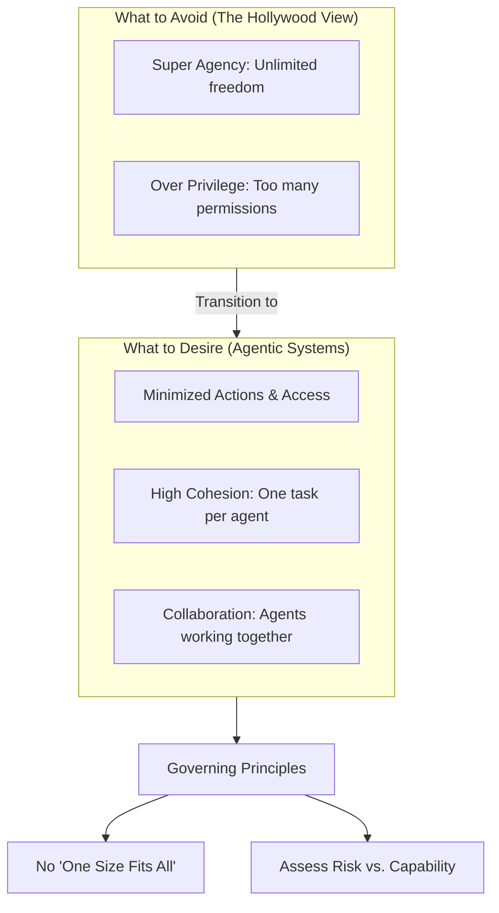

This video features **Grant Miller**, Distinguished Engineer at IBM, explaining the evolution of AI agents from the "Hollywood" concept of a single "super agent" to a more secure and collaborative "agentic system."

Below is the transcript of the video, followed by Mermaid diagrams illustrating the core concepts.

---

### **Video Transcript**

**[00:00] Grant Miller:** Howdy, everyone! Today we're going to explore the complex world of AI and dive into decision-making processes that drive AI applications today, and how do we categorize their abilities to help assist in handling agent interactions.

**[00:17]** The way we kind of have been thinking about agents today is they're these "super agents," and they can do everything we want them to do. They can go interact with any system we want them to be able to interact with, and they can do all the things that we want them to be able to do. And quite honestly, this is kind of the Hollywood view of how agents work. They're super agents and they can do all sorts of great stuff, but they tend to go a little bit rogue and they start doing stuff that we don't want them to do. And there's a lot of movies over the last several decades that kind of get into these super agents kind of starting to do things that have extreme prejudice against humans.

**[01:00]** The way we *really* should be thinking about agents is more that they're a set of agents that are working together, that are collaborating together, that they have a very specific task that they're trying to accomplish, and they have to do that in conjunction with other agents to complete a bigger process or task. I kind of have a view now that's a little bit more of a physical view, but it kind of explains the idea. Say you were doing something like a road project, and you have different agents that are directing, or doing work, or managing the system, or filing reports—all of those have to work together to actually create an agentic system. And this is really how we want to be viewing how agents look and operate and act.

**[01:45]** So, when we think about that, how is it that we want that to really happen? What are the implications that we have for interacting with agents as we start trying to figure out how we're going to do this? To talk about that, the first thing that we really want to do is talk about what is it that we want to **avoid**.

**[02:05]** The first thing we want to avoid is **Super agency**. And this is really how much freedom does an agent have to go off and do whatever it wants to do. We don't want super agency, which means that it can go do *anything* it wants. The other thing we want to do is avoid **Over privilege**. And this just really says, when we define what the agency is that an agent has, what is it allowed to—what actions can it actually take? Can it read? Can it write? Can it delete? Can it update? So, we really want to avoid both the ability to do too much and have too many privileges.

**[02:49]** So, what is our **desire** then? Our desire, as we start thinking about this, is first we want to **minimize the actions and the access**. And this is really starting to think about what it is when we break down the agents like we had the drawing before of a set of agents. If we have multiple agents, what are the actions? What's the minimal action we need it to do? And for that action, what's the minimum access we need? And if you really think about these in software engineering terms, this really then is what is called **High cohesion**, which basically just says you have a high cohesion between an agent, the one task it does, and the access it needs to do that task. The last thing that we really desire is, again, for us to have a set of agents that **collaborate**. That they're working with each other. We don't want the single agent that's going off and doing everything for us; we want just a set of agents, and we want them to collaborate together.

**[04:03]** Now, when we start thinking about how we're going to do this, we have to first start thinking about what does it mean to represent an agent. What we don't want is all agents basically operate and interact and are the same. There is, when we think about how we have agents, **no one size that fits all**. And especially if we're thinking about breaking them down to different actions, we really need to think about how we're going to represent those agents.

**[04:41]** And a really good way to do this is kind of think about agents on a spectrum. They can do minimal things; they can do a lot of stuff. So, if we think about a **spectrum** of what an agent is allowed to do, there's either going to be **Risk** associated with what they're capable of doing, or we think about their **Capability**. And this relates to what we were talking about. There's low risk—in other words, if something happens with that agent, no damage is done—and then there's high risk, where it's connecting to sensitive systems and we—there's a lot of risk associated with it. Capability is low capability—it really doesn't have to reason or think a lot, it does not have to figure out where it's going and what it's interacting with; high capability is there's a high likelihood that it's going to interact with systems and it has to figure all that out.

**[05:40]** So, we think about this in terms of a spectrum, and we really can break this down a little bit further and kind of look at it really more as a set of **quadrants**. And the quadrants are Low Risk to High Risk, Low Capability to High Capability. To give you kind of an idea of what this really looks like:

*   **High Capability, Low Risk:** This is really kind of a system like an internal style guide editor, where it can go read information and rewrite it depending on tone or whatever it is that you want it to do. So, it's really not dealing with sensitive information, but it has a lot of ability to take action.
*   **Low Capability, Low Risk:** This could be a very simple RAG model that goes off to an internal Wiki and brings information back. Again, really doesn't do a whole lot capability-wise—it just goes, it reads, it brings it back—and the information it's operating in is very low-risk information.
*   **Low Capability, High Risk:** This is something like a finance data extractor, right? It has read-only access to sensitive information, finance information, but it extracts it, brings it back, and summarizes it. So, it does one task, but it does it against sensitive information.
*   **High Capability, High Risk (The "Focus" Area):** That could be a system that is, perhaps, like an Accounts Payable initiate-a-payment [agent]. So, it has to figure out what the invoice is, who the client is, what we need to do, what actions we need to take, how much are we going to pay, and it actually initiates a payment. So, it's high capability and it's high risk because it's actually dealing with financial systems, making actions, paying systems, and that goes against the ledger.

**[07:35]** So, we kind of think about them in these terms. If we break this down just a little bit further, this lower quadrant [Low Capability]—this is very much like systems that we operate in today. We really kind of know how these systems operate, and so there's not a lot that we need to do; we can just treat them more traditionally. Whereas as we're really talking about this upper-right quadrant [High Risk/High Capability], this is where the more risk is for agentic systems, and this is really an area where we want to provide a lot more focus.

**[08:08]** So, let's break this down a little bit more. If we're talking about low risk, we're talking about **limited damage**. If we're talking about systems that are more risky, then we're talking about, you know, there's a lot of potential for **damage**. Agents in these [High Capability] systems can **Reason**; whereas the agents in these [Low Capability] systems, what they're really doing is they're taking **pre-determined** actions. We've already decided what it is that they need to do, and that's the action they're going to take. Whereas these [High Capability] are really more **non-deterministic**. With the reasoning, they're going to decide what it is that they need to interact with and the actions that they need to take on different systems and tools and resources.

**[09:36]** So, what does that mean when we're building these more action-specific agents? For the things that are really more high capability, we want them to be **Ephemeral**. In other words, we don't want them to hang around very long. We want them to come in, do their task, and then go away because it's changing all the time—they're applying a lot of reasoning, it's non-deterministic. Whereas these [Low Capability], we can actually make these much more **Persistent**. They can hang around because they're basically just assigned to do a very specific task.

**[10:21]** Again, when we start talking about high capability, we also want to make these have **Dynamic Access**. Because they have more reasoning, they're non-deterministic, they're figuring out what they're going to interact with—because that path changes every time, we want to assess every path through what they're allowed to do. Can they connect to a tool? What action can they take? All that needs to be determined based off of the context of what that agent is trying to accomplish.

**[11:04]** If we think of down here [Low Capability/Low Risk], the access is really what we always think about with normal access. In other words, it's really more of your traditional **non-human identities (NHI)**. So, these are API keys, they're credentials, they're certificates—whatever it is. It's persistent, it's pre-determined, and we just can let it connect.

**[11:34]** I'll go back to this **focus area** (High Risk/High Capability). One of the things that we want to consider here is that we want to put a **Human-in-the-loop (HILT)**. Before an agent issues the payment, we may want to actually go out, connect with a human, and say "this action is about to happen, do you approve that?" If you approve it, then we continue the thing. As we get into this [High Risk/Low Capability] quadrant, maybe there's just **extra business controls** that we want to do.

**[12:35]** So, we've talked about: we do not want super agents that are going off and doing everything. We really want to break that down into a set of agents that have very specific tasks and they work in collaboration with each other. But we don't want to treat all agents the same. We really look at it in this 2x2 matrix based on a capability and risk of what we allow those agents to do and how we want them to behave. And this is the approach that [you should] really think about as you're developing your agentic systems.

---

### **Core Concepts Diagram**

This diagram summarizes the move from "Super Agents" to "Agentic Systems" and the governing principles mentioned by Miller.



---

### **Agent Classification Matrix (The 2x2 Matrix)**

This diagram visualizes the quadrant system Grant Miller used to categorize different types of AI agents.

```mermaid
quadrantChart
    title Agent Capability vs. Risk Matrix
    x-axis Low Risk (Limited Damage) --> High Risk (High Damage)
    y-axis Low Capability (Pre-determined) --> High Capability (Reasoning)
    quadrant-1 High Capability, Low Risk
    quadrant-2 High Capability, High Risk (FOCUS AREA)
    quadrant-3 Low Capability, Low Risk
    quadrant-4 Low Capability, High Risk

    %% Examples and Traits
    "Internal Style Guide Editor": [0.25, 0.75]
    "Simple RAG / Wiki Reader": [0.25, 0.25]
    "Finance Data Extractor": [0.75, 0.25]
    "AP Payment Initiator": [0.75, 0.75]

    %% Defining traits mentioned in the second half of the video
    "Non-deterministic / Ephemeral / Dynamic Access": [0.5, 0.85]
    "Pre-determined / Persistent / Traditional NHI": [0.5, 0.15]
    "Human-in-the-loop (HILT)": [0.85, 0.85]
    "Extra Business Controls": [0.85, 0.15]
```