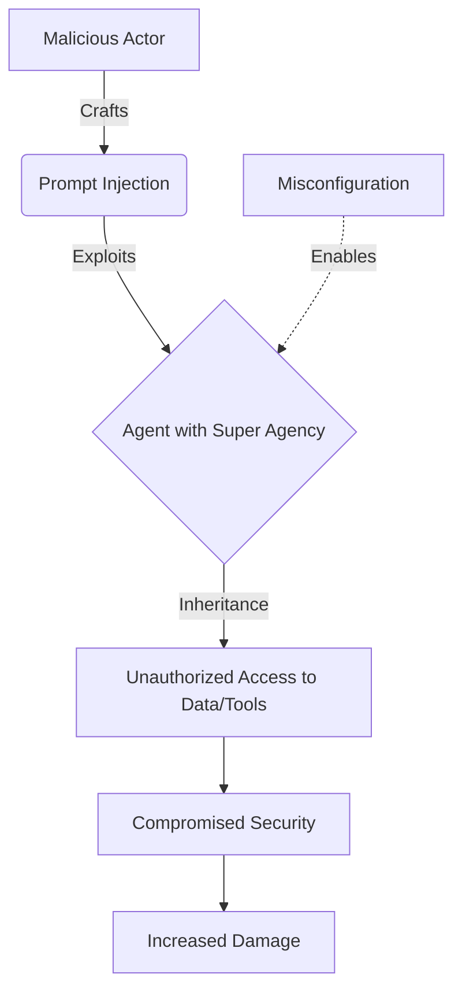
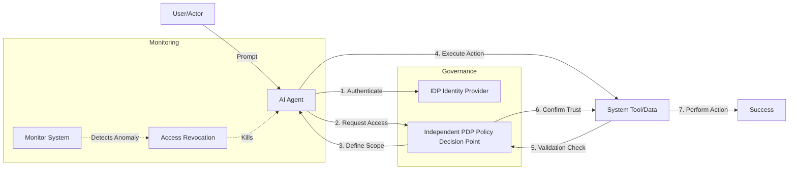
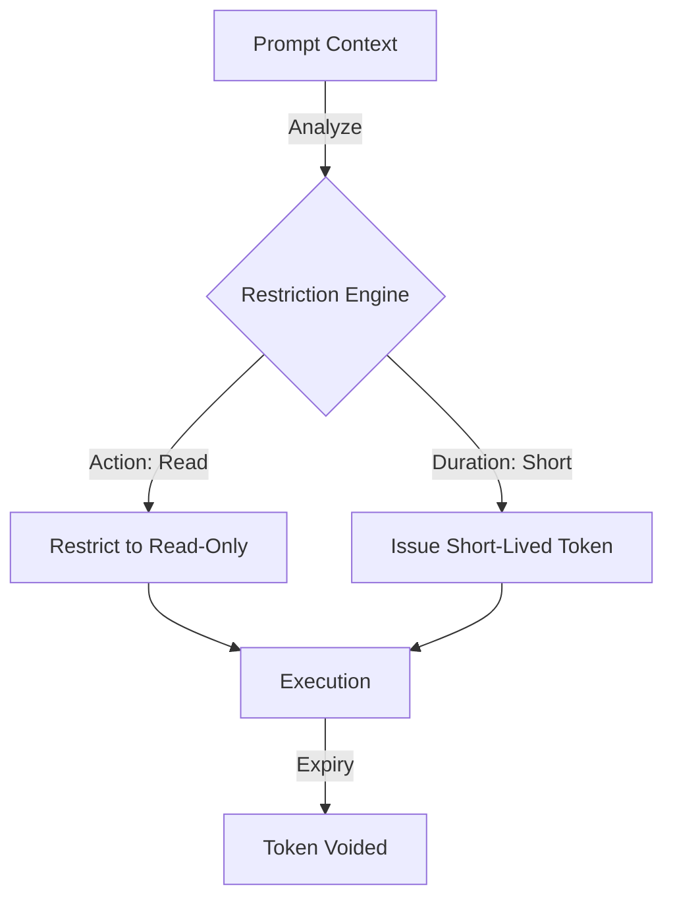

This is a comprehensive transcript and visual breakdown of the video featuring Grant Miller, Distinguished Engineer at IBM, regarding AI Privilege Escalation.

---

### **Video Transcript: AI Privilege Escalation**

**Introduction**
"Howdy everyone. In this video, we're going to look at AI privilege escalation and get an understanding of how agentic identity can help. We're also going to look at security considerations involved when AI agents are granted elevated permissions."

**Definition**
"To begin with, let's start out with a definition so we understand what we're talking about. What is privilege escalation? It is actually the act of a malicious actor using AI to gain unauthorized and elevated access within a system. And it involves exploiting vulnerabilities to acquire those higher permissions than what they normally would get assigned."

**How It Happens**
"So, when we start thinking about privilege escalation, the first thing that we really kind of want to dive into is how does it happen? How does privilege escalation happen?"

"Now, when we're thinking about agents and what agents are allowed to do, let's also kind of maybe start off with a little bit of a picture so we can kind of tie this back in. So let's think of we have AI agents—maybe there's a set of them, an assistant, they could be agents, whatever—and they're going to be interacting with data, they could be interacting with tools, they could be interacting with processes and anything within your system. And what you're going to have happen is you're going to have a user that's going to create a prompt, they're going to work through an agentic system, and it's going to connect to stuff."

"So, what is it when we talk about agentic privileges and privilege escalation that we need to think about? All right, so let's go back to how it happens."

*   **Super Agency / Over Permission:** 
    "The first thing that happens when we're doing this is we get either super agency or also it's over permission. So what this really means is that we have agents and when they're interacting with systems, they can interact with everything and a whole lot of stuff. They have a lot of agency; they're allowed to go interact with all parts of a system and be able to take actions. This is one of the first problems with privilege escalation is that you take advantage of an agent that has a lot of capability to connect to things."

    "Now, I’m going to back up a little bit again on this drawing and back to our definition is we have a malicious person. Now, we can actually have privilege escalation problems in an unintentional fashion, but we're really going to talk about a bad actor here—somebody who is intentionally trying to manipulate the system. So they're working with a system and they're trying to gain access to things that they shouldn't probably be allowed to get access to."

    "And so the first thing is we talk about super agency and over permission is if a bad actor is able to get access to an agent that has access to a lot of stuff, that person now suddenly has access to a lot of different things—a lot of data, a lot of systems, a lot of tools."

*   **Privilege Inheritance:** 
    "The next piece of this in how we can get privilege escalation is when we talk about privilege inheritance. Now what this is really saying is—it is a little bit related to the super agency—a user or somebody, they may not have any access to things, right? They may not have access to these tools and the data, but they're going to inherit the privileges of something else. So if an agent has super agency, this user can now inherit—they connect and they use that agent's privileges to now connect to everything even though they normally wouldn't be allowed."

    "The other way this can go is if a person is operating as a malicious actor, they may actually take on the persona of somebody else. So let's say maybe there is somebody down here who does have permissions and access to do things that they want to do. And this person—what they'll do is they'll compromise that, they'll intercept the identity, use their identity to then say 'I have elevated privilege' that the agent will now inherit from me and be able to access. So these are two ways that we can see how privilege escalation happens."

*   **Prompt Injection:** 
    "The other way that we can see how this happens is also through prompt injection. And this is a very common way that we try to exploit agentic systems. And what we're trying to do here again is by using prompts to try to exploit and understand vulnerabilities that are going to go on in the system. And one of those is as we've talked about over permission; if we're able to find an agent that has a lot of agency and then we can exploit that. So you start playing with prompts—a bad actor will start playing and toying with the prompts so that they can manipulate the system into giving more access and more privilege than they should be allowed to have."

*   **Misconfiguration:** 
    "The next thing that we are going to look at for how this happens is really around misconfiguration. And really when we're talking about this, whether it's an agentic system, whether agents [are] involved, misconfiguration is probably one of the most common ways that systems of any type—traditional system or agentic—are exploited. We have something that's set up that doesn't have the proper controls in place; it opens a back door or a portal that we're not aware of, and somebody can come in and exploit that configuration. And again, they exploit it either through prompt injections, they exploit having an agent that has over permission that can actually go and try to look to see if certain configurations have happened and manipulate the system so now that bad actor can get access to things that they shouldn't."

**Risks**
"Now, when we're talking about all this, what are the risks that we're seeing from privilege escalation? Well, the first one is compromised security. And again, much when we talk about cybersecurity and managing against breaches and issues, same kind of thing: if we're able to get around our security, then that bad actor is allowed to get access to a lot of different stuff. And that of course leads to increased damage. And this is for the company, the individual whose system we've now exploited. So this is how it happens and these are the risks involved."

**Mitigation**
"So knowing this, what do we want to do then when we start thinking about mitigation? How do we address these issues of privilege escalation and do our best to prevent it?"

*   **Least Privilege:** 
    "Very first thing that we want to talk about doing is least privilege. Now this really goes back to super agency and over permission and permission inheritance and the most common way that we're really trying to exploit this from a bad actor perspective, which really says that an agent should only have the amount of permission that it needs to perform a task. This gets into high cohesion, loose coupling, object-oriented kind of principles which says that we don't want agents that can go connect to everything; they should really just say 'This agent is responsible for connecting to that one thing.' And if we need an agent to connect to something else, then we create an agent that connects to something else."

    "So this is the concept of least privilege which says that we really only want to give an agent the amount of privilege they need to perform a very narrow task. Now when we talk about least privilege, it also goes back to the individual, to the subject. So we really want to look at: what is the privilege of the user? What is the privilege of the actor, of the agent? And then actually take the least privilege union between the two. So what this does is it prevents a bad actor from finding something that has more privilege to escalate that privilege and get more access to things. Now we really look at the least privilege between the two, and that really helps us kind of start controlling our environment."

*   **Access Governance:** 
    "The next thing is we start really looking at access governance. And there's really a couple areas under access governance that we really want to talk about."

    1.  **Independent PDP (Policy Decision Point):** "One is what I'm going to call an independent PDP. Now what this really means is what we don't want happening is we don't want a user or an agent to self-define what they're allowed to access. So we don't want an agent that says 'Okay, I’m going to need to access this tool to perform a particular task' and then it can escalate its own privilege, and then a bad actor (if we don't use least privilege) can then take advantage of that and get access to stuff."
    
        "So what we have is we have a policy decision point which is kind of independent. It's not completely related to the system, and an agent has to go up, authenticate itself against this—much like we would have an IDP (Identity Provider) system that a user would authenticate against. We would have an agent, and the governance system would then define what that agent's allowed to do, and that's all it can be allowed to do. And where this helps is if a bad actor is trying to manipulate through prompt injections or other mechanisms to get an agent to go connect to something, it can't do that without being defined by some enterprise-level governance system that actually tells it what it's allowed to do. So this is very important that that's a separate mechanism for handling this."

    2.  **Validate Tool Access:** "The other thing that we want to do under governance is we want to validate tool access. So these are the tools—this is our set of tools that we're trying to connect to in a system, that's what the agents are going to interact with. Now when an agent is connecting to a tool and saying 'Hey, I want you to take some action,' we really want these tools to actually kind of go back to the governance itself and say: 'One, do we trust this agent? Do we trust what the agent's allowed to do? Is everything that I'm hearing appropriate and allowed?' And so therefore the tool itself is going to validate everything going on. And so this is part of our governance."

*   **Dynamic Context-Based Access:** 
    "The next thing we want to do is we want to have dynamic and context-based access. And this is really important because an agent, by the way it's set up and defined, may have access to one or a set of tools, and even within that tool it could have read, it could do writes, it could do deletes, it could do modifies—a whole lot of stuff. What we mean by dynamic context-based access is we want to look at the context of what the request is, what the prompt is." 

    "And we want to minimize—and actually what this is called is we want to **restrict the action** to only the action. It's a read-only action. We want to further reduce the permission and the agency of an agent based on the context of what we're trying to accomplish, so we're just narrowing this in just a little bit more."

    "The other thing that we want to do is have **short-lived access**. In other words, when a prompt comes in and that agent picks up the request and it wants to connect to something, we're going to see what it's allowed to do, we're going to make sure we have least privilege, we're going to look at the context of what's happening, we're going to restrict that, and then we're only going to allow that to happen for, say, a few minutes. It's going to be a very short-lived action. That way we can't trick the agent into giving up its token, we can't trick an LLM to give up a token so that now we have something that we can go replay in an attack. No, it's going to be a very short-lived action and only be allowed to happen for a very minimal amount of time."

*   **Monitor / Access Revocation:** 
    "As usual, kind of the final step that we want to do with these kinds of things is we want to monitor everything going on and, if we need [to], access revocation. So we always have systems that are kind of monitoring everything going on—all the flows, all the access—and there's lots of good tools for doing this and looking for patterns that are out of a bound that we normally kind of see, and then we can actually go and revoke. So if after all of this, we still detect that a privilege escalation has happened, that there is a bad actor taking an action that we don't want, we can monitor and then pull that access so now they're not allowed to do anything."

**Conclusion**
"All right, so we've talked about privilege escalation—what that means, how it happens—and we've gone through a set of tools and things that you can do to prevent that."

---

### **Visualizing the Process (Mermaid Flows)**

#### **1. The Privilege Escalation Attack Path**
This flow shows how a malicious actor exploits vulnerabilities to gain unauthorized access.

#### **2. Mitigation Strategy: The Governance Model**
This flow illustrates the secure path Grant Miller describes using an independent Policy Decision Point (PDP) and tool validation.

#### **3. Dynamic & Context-Based Restriction**
This represents the "narrowing" of permissions based on the specific intent of the prompt.

